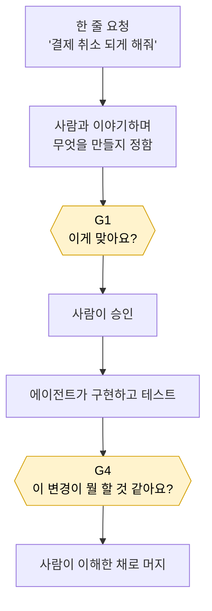

# AI Workflow Kit

AI와 함께 일할 때 **사람이 이해를 놓치지 않게** 하는 작업 규칙입니다.
Claude Code · Codex · ChatGPT에서 같은 방식으로 씁니다.

```bash
npx @syjkim0125/ai-workflow-kit init
```

---

## 그림 한 장



## 다섯 문장

에이전트는 코드를 아주 빨리 씁니다.
사람이 읽는 속도는 그대로입니다.
그래서 아무도 이해하지 못한 코드가 쌓입니다.
이 키트는 사람이 승인하기 **직전**마다 짧은 확인을 거치게 합니다.
확인 없이는 다음 단계로 못 갑니다.

---

## 노란 상자 두 개가 하는 일

### G1 — 만들기 전

무엇을 만들 건지 한 화면짜리 계약서로 정리해서 보여줍니다. 그리고 묻습니다:

> **"이 내용이 이번 구현의 범위와 완료 조건으로 맞나요?"**

여기서 중요한 건 **질문을 아껴 쓴다**는 점입니다. 동작이 달라지는 것만 묻고, 최대 세 개까지, 두 번 물어보고 멈춥니다. 나머지는 안전한 기본값으로 채우고 `ASSUMED`라고 표시해둡니다. 끝없는 인터뷰가 되지 않게요.

### G4 — 머지 전

**설명을 먼저 안 보여줍니다.** 바뀐 코드와 테스트 결과만 보여주고 묻습니다:

> **"이 변경이 무엇을 바꾸나요? 어떤 불변 조건이나 실패 경로가 있고, 어떤 테스트가 그걸 증명하나요?"**

답하고 나서야 정답이 나옵니다. 그리고 **맞은 것 / 놓친 것 / 틀린 것** 세 가지로 짚어줍니다.

먼저 맞춰보게 하는 이유는, 설명을 읽는 것과 이해하는 것이 다르기 때문입니다.

---

## 지키게 만드는 방법

규칙을 문서에 적어두는 것만으로는 지켜지지 않습니다. 그래서 게이트는 **파일을 남기고, 그 파일을 기계가 검사합니다.**

```text
Understanding gate (G4): docs/understanding/cancel-diff.md · 2026-08-31 · Check-in: accepted
G4: PASS — 환불은 결제수단으로만 돌아간다는 불변 조건을 담당자가 재진술함
```

```bash
node .ai-workflow/bin/check.mjs story docs/STORY.md
```

이 검사기가 잡는 것:

| 검사 | 막는 상황 |
|---|---|
| 게이트 기록 줄이 있는가 | 확인 없이 넘어감 |
| 증거 파일이 실제로 있고 **비어 있지 않은가** | 백지를 제출함 |
| 모든 `MUST`가 `Verify` 항목에 연결됐는가 | 검증 안 되는 요구사항 |
| `OPEN BLOCKING`이 남아 있는데 승인됐는가 | 미해결 쟁점을 안고 출발 |
| `G4: PASS`에 사람의 재진술이 적혀 있는가 | "이해했다"는 주장만 있음 |

작은 변경이라 건너뛰고 싶으면 그것도 적습니다. 다만 **구체적인 이유**를 요구합니다:

```text
Understanding gate (G4): N/A — 주석만 변경, 실행 동작 변화 없음
```

건너뛴 것도 기록이라 눈에 보입니다.

---

## 시작하기

```bash
npx @syjkim0125/ai-workflow-kit init
```

레포에 이것만 들어갑니다:

```text
AGENTS.md · CLAUDE.md      마커 사이에 짧은 규칙 블록 (바깥은 안 건드림)
.claude/skills/workflow/   Claude Code용 스킬
.agents/skills/workflow/   Codex용 스킬
.ai-workflow/bin/          검사기
templates/ai-workflow/     Story · Task 템플릿
```

한쪽 런타임만 쓴다면:

```bash
npx @syjkim0125/ai-workflow-kit init --host claude
npx @syjkim0125/ai-workflow-kit init --host codex
```

### 부르는 법

| 런타임 | 시작 |
|---|---|
| Claude Code | `/workflow 결제 취소 되게 해줘` |
| Codex | `$workflow 결제 취소 되게 해줘` |
| ChatGPT | `skills/workflow/` 폴더를 Skill로 올리면 관련 요청에서 **자동으로** 선택됩니다 |

한 번만 부르면 됩니다. 스킬이 Story의 상태를 읽고 알아서 다음 단계로 갑니다. 세션이 끊겼다 돌아왔다면 `/workflow` 또는 `/workflow finish`로 다시 들어가면 됩니다.

---

## 계약서는 한 장뿐

요구사항 원본은 **Story 하나**입니다.

```text
Goal · Domain · MUST · SHOULD · OUT · Decisions · Verify
```

별도의 "AI용 요구사항 문서"를 만들지 않습니다. AI가 필요한 코드·테스트·plan 맥락은 실행할 때 붙이면 됩니다. 원본이 둘이 되는 순간 둘은 어긋나기 시작합니다.

**Task는 Story 하나를 한 PR로 리뷰할 수 없을 때만** 만듭니다. 30줄 이하로, Story의 `M`/`V` 번호만 참조합니다. 구현 방법은 Task가 아니라 plan이 담당합니다.

---

## 명령어

```bash
ai-workflow-kit init            # 설치 · 업데이트
ai-workflow-kit doctor          # 설치 상태 점검
ai-workflow-kit check story  <file>
ai-workflow-kit check task   <file>
ai-workflow-kit check gate G4 <story-file>
ai-workflow-kit remove          # 제거
```

`init`은 여러 번 돌려도 안전합니다. `remove`는 마커 **사이만** 지우고, 사용자가 고친 템플릿과 게이트 증거는 남깁니다.

---

## Compound Engineering 연동 (선택)

설치돼 있으면 `ce-plan → ce-work → ce-code-review`를 그대로 씁니다. 없어도 같은 plan·work·review 단계를 호스트 기본 기능으로 진행합니다. 이 패키지는 Compound Engineering을 포함하지 않습니다.

---

## 개발

```bash
npm test        # 34 checks
npm pack        # 로컬 tarball
```

로컬 tarball로 시험 설치:

```bash
npx --package ./syjkim0125-ai-workflow-kit-3.0.0.tgz ai-workflow-kit init
```

배포는 scope 소유자 인증 후:

```bash
npm publish --access public
```

---

MIT · [JongKun Kim](https://github.com/syjkim0125)
