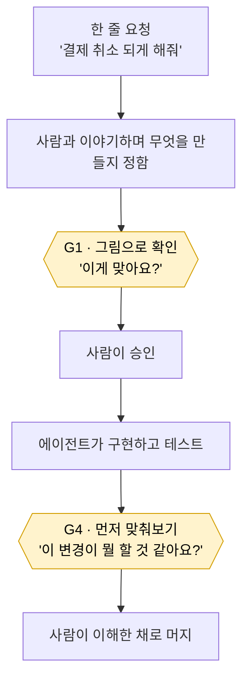
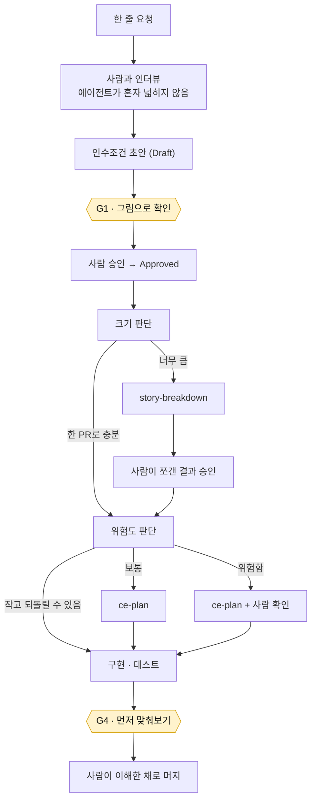

# ai-workflow-kit

AI 에이전트와 함께 일할 때 **사람이 이해를 놓치지 않게** 하는 작업 규칙 모음.

## 그림 한 장



## 다섯 문장

에이전트는 코드를 아주 빨리 씁니다.
사람이 읽는 속도는 그대로입니다.
그래서 아무도 이해하지 못한 코드가 쌓입니다.
이 키트는 사람이 승인하기 **직전**마다 짧은 설명을 만들게 합니다.
설명 없이는 다음 단계로 못 갑니다.

## 전체 흐름

위 그림은 게이트 두 개만 보여줍니다. 실제로는 이런 순서입니다.



사람이 판단하는 지점은 네 곳입니다: 인수조건 승인, 쪼갠 결과 승인, 위험한 작업의 계획 확인, 그리고 머지.

## 노란 상자(게이트)가 하는 일

**G1 — 만들기 전.** 무엇을 만들 건지 그림 한 장으로 보여줍니다(이것을 인수조건이라고 부릅니다). 그리고 이렇게 묻습니다: *"당신이 말 안 해서 제가 정한 것들, 이게 맞나요?"*

**G4 — 머지 전.** 설명을 **먼저 안 보여줍니다.** 바뀐 코드만 보여주고 묻습니다: *"이게 뭘 하는 것 같아요?"* 답하고 나서야 정답이 나옵니다. 틀린 부분이 어디였는지 알려줍니다.

맞춰보기를 먼저 하는 이유는, 설명을 읽는 것과 이해하는 것이 다르기 때문입니다.

## 지키게 만드는 방법

규칙을 문서에 적어두는 것만으로는 지켜지지 않습니다. 그래서 게이트는 **파일을 남깁니다.**

```text
Understanding gate (G1): docs/understanding/2026-08-27-checkout.html · 2026-08-27 · Check-in: accepted
```

이 G1 줄이 없으면 인수조건이 승인되지 않습니다.
"설명했습니다"라고 말할 수는 있어도, 없는 파일을 있다고 할 수는 없으니까요.

작은 변경이라 건너뛰고 싶으면 그것도 적습니다:

```text
Understanding gate (G4): N/A — 상수 한 줄 변경
```

이 G4 줄이나 N/A 기록이 없으면 머지할 수 없습니다.
건너뛴 것도 기록이라 눈에 보입니다.

## 시작하기

```text
한 번만    /plugin marketplace add syjkim0125/ai-workflow-kit
           /plugin install ai-workflow-kit

레포마다   /workflow-setup

업데이트   /plugin update  →  /workflow-setup 다시 실행
```

`/workflow-setup` 은 레포에 다섯 가지만 씁니다: `AGENTS.md`/`CLAUDE.md` 안의 관리 블록,
`.ai-workflow/bin/`(게이트 검사기와 훅 스크립트), `.ai-workflow/VERSION`,
`templates/`와 `docs/engineering/`, 그리고 `docs/understanding/`.
쓰기 전에 diff를 보여주고 물어봅니다. 마커 바깥은 건드리지 않습니다.

설치 상세와 이행 경로: **[README-FIRST.md](README-FIRST.md)**

| 알고 싶은 것 | 읽을 곳 |
|---|---|
| 어떻게 설치하나 | [README-FIRST.md](README-FIRST.md) · [AI-SETUP.md](skills/workflow-setup/references/engineering/AI-SETUP.md) |
| 전체 작업 흐름 | [AI-WORKFLOW.md](skills/workflow-setup/references/engineering/AI-WORKFLOW.md) |
| 항상 지킬 원칙 | [관리 블록 원문](skills/workflow-setup/references/agents-block.md) |
| 게이트가 뭘 물어보나 | [UNDERSTANDING.md](skills/workflow-setup/references/templates/UNDERSTANDING.md) |
| 왜 이렇게 만들었나 | [AI-WORKFLOW-SOURCES.md](skills/workflow-setup/references/engineering/AI-WORKFLOW-SOURCES.md) |

## 필요한 것

- 코딩 에이전트 (Claude Code 또는 Codex)
- [Compound Engineering](https://github.com/EveryInc/compound-engineering-plugin) 플러그인 — 게이트의 설명 엔진(`ce-explain`)이 여기 들어 있습니다
