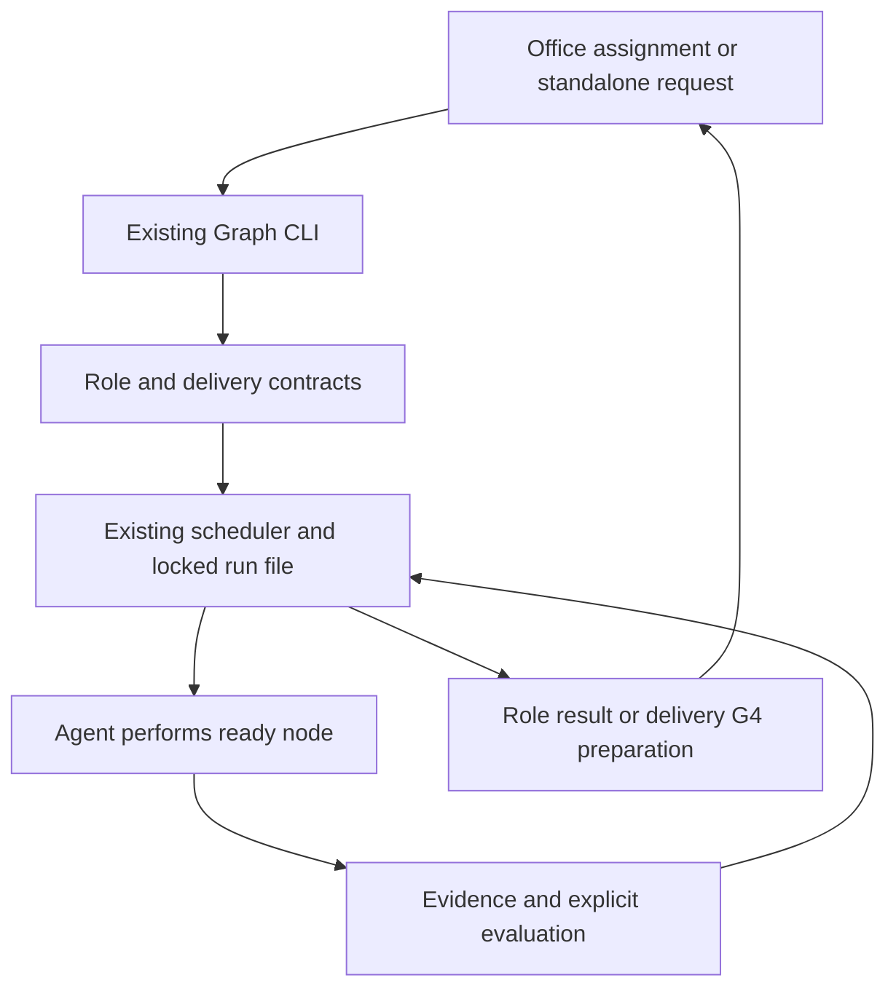

## Goal Capsule

kit controls an agent's assigned work. Office coordinates a shared goal. Implement the approved [Story](../role-graph-story.md), preserving delivery v1 and existing runtime guarantees. No Office edits or new runtime dependency.

## Product Contract

Requirements and acceptance examples are canonical in Story M1–M5 and V1–V5. This plan specifies HOW without duplicating acceptance criteria. The user authorized execution; final human acceptance remains pending.

## Planning Contract

- KTD1. session-settled: kit owns role-local work; Office owns shared requirements, assignments, collaboration, integration and real approvals.
- KTD2. Extend the durable CLI, not the generic executor. Role v2 runs bind an assignment to a source fingerprint. Existing delivery v1 stays readable. Role completion is a distinct terminal action.
- KTD3. Use built-in PM, lead, developer and reviewer flows with direct dependency outputs. Developer self-checks never replace independent review. A completed review can report needs_changes.
- KTD4. Questions preserve the running attempt, rotate tokens and pause new dispatch. Answers are contextual input, never approval. Bound question exchanges per node. Feedback uses a current run token, evidence and the existing affected-subgraph reset.
- KTD5. Local files are authoritative for kit transitions. Office stores its own goal/assignment/message/approval state and can index kit results. It must not recreate local transitions in its database.

### High-Level Technical Design

```mermaid
stateDiagram-v2
  pending --> running: start with token
  running --> question: question
  question --> running: matching answer; new token
  running --> completed: validated evidence
  running --> failed: actionable failure
  failed --> pending: bounded fix
  completed --> pending: current feedback; affected work
```

The sketches show responsibility and transitions. They do not add another scheduler or define Office's internal storage.

## Implementation Units

### U1. Persistent role entrypoint

Story M1/M2; KTD1–KTD3. Add role assignment validation and built-in graphs to `src/graph/`, reuse CLI validation/storage, and return role identity, completion output and revision binding. PM reads an unapproved request; other roles require the approved canonical Story. Test-first through the installed CLI: all roles, invalid scope, changed source, rejected draft implementation, role completion without G4, reviewer needs_changes, old v1 compatibility.

### U2. Questions and feedback

Story M3/M4; KTD4/KTD5. Extend existing CLI commands and run history. Test-first: interrupted question/resume, wrong/duplicate reply, old worker output, bounded exchanges, feedback evidence, stale feedback, affected-node reset and preserved attempts. Keep existing atomic write and writer exclusion behavior.

### U3. Routing and Office handoff

Story M5; KTD1/KTD5. Update installed workflow references, both READMEs, handoff and a standalone Korean Office prompt. Publish exact command/input/output examples and migration rules. Distinguish CLI-enforced state rules from host permissions and Office acceptance. No tests that merely match new prose.

## Verification Contract

Use `node --test test/graph-role-cli.test.mjs` for new installed behavior, `node --test test/graph-cli.test.mjs` for existing durable behavior, then `npm test` once changes settle. Run `npm pack --dry-run --ignore-scripts --json` and `git diff --check`. Review error paths and stale input handling inline; do not call this an independent agent review. Update existing Compound guidance only after fresh verification.

## Definition of Done

Story V1–V5 have fresh evidence; rejected mutations preserve the run; role outcomes never imply user acceptance. Office prompt identifies actual supported commands and remaining integration work. Document limits and leave G4 pending. Commit/push the feature branch under existing authorization; user owns merge and npm release.
