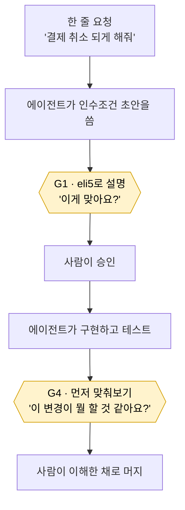

# Learning Gate Implementation Plan

> **Historical planning record — superseded during execution.** The shell code shown below (argument parsing, checker resolution, two insertion points) does not match what shipped; see `real-work/.claude/skills/learning-gate/` for the shipped code.

> **For agentic workers:** REQUIRED SUB-SKILL: Use superpowers:subagent-driven-development (recommended) or superpowers:executing-plans to implement this plan task-by-task. Steps use checkbox (`- [ ]`) syntax for tracking.

**Goal:** 키트의 인간 게이트 앞에 eli5-우선 3층 학습 아티팩트를 의무화하고, 그 통과 여부를 파일 존재로 검사 가능하게 만든다.

**Architecture:** `ce-explain`을 학습 엔진으로 쓰고 eli5 레지스터를 필수 첫 층으로 강제한다. 무거운 질문 슬롯은 `templates/UNDERSTANDING.md` 한 벌이 소유하고, `.claude`/`.agents` 스킬 미러 두 벌은 얇게 유지한다. 강제력은 산문 규칙이 아니라 **기록 줄 + 아티팩트 파일 존재**에서 나오며, 그 검사는 런타임 중립 bash 스크립트가 담당한다. Claude 전용 hook은 그 스크립트의 옵인 래퍼일 뿐이다.

**Tech Stack:** Markdown (skills/templates/docs), Bash (checker + hook installer + tests), git/gh (HTTPS)

**Spec:** `docs/superpowers/specs/2026-08-27-learning-gate-design.md`

## Global Constraints

- 대상 디렉터리는 `/Users/jongkkim/Desktop/ai-workflow-kit`. 배포 페이로드는 `real-work/` 아래에만 만든다. 키트 개발 산출물(`docs/superpowers/`)은 루트에 둔다.
- `.claude/skills/learning-gate/SKILL.md` 와 `.agents/skills/learning-gate/SKILL.md` 는 **바이트 단위로 동일**해야 한다. 스크립트는 미러하지 않고 `.claude/...` 한 벌만 둔다 (`usage-handoff` 선례).
- 기록 줄 문법은 정확히 다음 둘 중 하나다. 구분자는 U+00B7 가운뎃점 `·`, N/A 사유 앞은 em dash `—`:
  - `Understanding gate (G1): <path>.html · <YYYY-MM-DD> · Check-in: accepted|declined`
  - `Understanding gate (G4): N/A — <사유>`
- 게이트 식별자는 `G1` `G3` `G4` `G5` 넷뿐이다. `G2` `G6` 는 유효하지 않다.
- 아티팩트 경로는 항상 레포 로컬 `docs/understanding/<YYYY-MM-DD>-<slug>.html`. 계약이 Jira에 있어도 아티팩트는 로컬에 남긴다.
- 테스트는 bash, 결과를 `PASS n / FAIL n` 카운트로 출력한다.
- 문서 본문 언어는 기존 파일의 언어를 따른다 (`AGENTS.md`/`AI-WORKFLOW.md`/`AI-SETUP.md`/`README-FIRST.md` 는 영어, `CHANGELOG.md` 는 영어).
- 외부 플러그인(`eli5`, `compound-engineering`)의 파일은 수정하지 않는다.

---

### Task 1: `templates/UNDERSTANDING.md` — 질문 슬롯과 기록 줄 문법

**Files:**
- Create: `real-work/templates/UNDERSTANDING.md`

**Interfaces:**
- Consumes: 없음
- Produces: 기록 줄 문법 (Task 2 checker가 검증), 게이트별 슬롯 목록 (Task 3 스킬이 로드)

- [ ] **Step 1: 파일 작성**

`real-work/templates/UNDERSTANDING.md` 에 다음 내용을 쓴다. 영어로 작성한다 (`templates/ACCEPTANCE.md` 와 동일 언어).

````markdown
# Understanding Gate — required content

This template defines what a learning gate must produce. Like `ACCEPTANCE.md`, it
specifies **required content, not a mandatory destination file**: the artifact is
written by the `learning-gate` skill, and the record line goes into whichever
artifact is canonical for the work.

## Three-layer artifact

Every gate artifact has exactly these three layers, in this order:

| Layer | Content | Budget |
|-------|---------|--------|
| 1. ELI5 | One picture. Five sentences or fewer. Zero jargon. | 30 seconds |
| 2. Decision | Only what the human must actually decide at this gate. | 3 minutes |
| 3. Density | Runtime/data-flow order, invariants, failure paths, what is still unproven. | as needed |

Layer 1 is not optional and is not decoration. A reader who stops after layer 1
must still know what the work does to a user. If layer 1 cannot be written
without jargon, the work is not understood well enough to gate.

Format: a single self-contained HTML file at
`docs/understanding/<YYYY-MM-DD>-<slug>.html`. Keep the artifact in the
repository even when the canonical contract lives in Jira — the record line
points at a local path, and that path is what verification checks.

## G1 — acceptance contract gate

**When:** immediately after the Acceptance contract is written as `Draft`,
**before** asking the human to approve it.

**Mode:** `ce-explain` concept/idea.

**Layer 2 slots — all four, in this order:**

1. **What will definitely work after this** — MUST items, restated as observable behavior.
2. **What we are deliberately not doing** — negative behaviors and out-of-scope items.
3. **What I decided because you did not say** — the unspecified-policies register.
4. **How we will know it is done** — the deterministic verification approach.

Slot 3 carries the most weight. It forces decisions the agent made quietly into
the human's field of view. An empty slot 3 is a claim that nothing was
underspecified — make sure that is true before writing it.

**Check-in:** offer one Boundary exercise — *"name one case where this contract
does not apply."* A human who cannot answer is looking at an ambiguous contract:
the outcome is a contract revision, not an approval.

Offering the check-in is required. Accepting it is not — `ce-explain` states the
user may always decline and that a decline is final. Record `Check-in: declined`
honestly rather than re-asking.

**Applies to:** every Acceptance contract, regardless of size. A small contract
produces a short gate; the layer budgets scale on their own.

## G4 — implementation gate

**When:** after implementation and verification pass, before merge or PR.

**Mode:** `ce-explain` diff.

**Order is part of the contract:**

```text
1. Show the raw diff or its stat summary — zero commentary
2. Ask: "what does this change do, and why was it made?" — then END THE TURN
3. Reveal all three layers only after the prediction lands
```

Layer 1's picture is interpretation. Showing it before the prediction destroys
the mechanic — `ce-explain`'s check-in reference calls this "dead on arrival".

**Layer 2 slots — all three, in this order:**

1. **Gap against the prediction** — what it got right, what it missed, what it got wrong.
2. **PASS/FAIL per MUST from the G1 contract**, each with evidence.
3. **What each test proves, and what remains unproven.**

**Passing:** the human can restate the change, and the record line is written.

**Skipping:** when the diff is small enough to read at a glance, record
`Understanding gate (G4): N/A — <reason>` instead. This mirrors the existing
`Plan source: N/A — small reversible task` convention. A skip is still a record,
so it stays visible.

## G3 and G5 — conditional gates, no new slots

Neither gate defines new slots. They reuse the ones above and narrow the scope.
More templates means more to maintain, and an unmaintained template is noise
rather than enforcement.

- **G3 (high-risk plan checkpoint)** — apply the G1 slots to the plan document.
  Slot 3 earns its place here: it surfaces the implementation direction `ce-plan`
  chose quietly. Reference anything already settled at G1 with a single line
  instead of restating it. Only for high-risk / hard-to-reverse work.

- **G5 (Story Acceptance verdict)** — only when a Story was split into two or more
  Tasks. Per-Task G4 runs already covered the individual diffs, so do not explain
  them again. Narrow to one question: **does the integrated whole satisfy the
  contract?** Layer 2 carries PASS/FAIL per MUST plus the integration points no
  single Task owned — behavior that only appears at Task boundaries.

## Record line

Write one line per gate into the canonical Acceptance artifact. Exactly one of
these two forms:

```text
Understanding gate (G1): docs/understanding/2026-08-27-checkout-contract.html · 2026-08-27 · Check-in: accepted
Understanding gate (G4): N/A — one-constant change, 4-line diff
```

Grammar:

- Gate id is one of `G1`, `G3`, `G4`, `G5`.
- Separator is a middle dot `·` surrounded by single spaces.
- The path ends in `.html` and must exist in the repository.
- Date is `YYYY-MM-DD`.
- Check-in is `accepted` or `declined`.
- The N/A form uses an em dash `—` and requires a non-empty reason.

Verify with:

```bash
bash .claude/skills/learning-gate/scripts/check-understanding.sh --gate G1 --contract <path>
```

## Blocking rules

- No `G1` record line → the contract must not move from `Draft` to `Approved`.
- No `G4` record line (or its `N/A` form) → the PR must not merge.

These are checkable facts, not prose commitments. That is the point: an agent can
claim it explained something, but it cannot claim a file exists when it does not.
````

- [ ] **Step 2: 문법 예시가 checker 정규식과 일치하는지 육안 확인**

파일 안의 두 예시 줄에서 구분자가 U+00B7(`·`)인지, N/A 앞이 em dash(`—`)인지 확인:

```bash
grep -n 'Understanding gate' real-work/templates/UNDERSTANDING.md | cat -A | grep -c 'M-BM-7'
```
Expected: `1` 이상 (가운뎃점이 UTF-8 `C2 B7` 로 존재)

- [ ] **Step 3: Commit**

```bash
git add real-work/templates/UNDERSTANDING.md
git commit -m "feat(templates): add UNDERSTANDING.md defining learning-gate slots and record-line grammar"
```

---

### Task 2: `check-understanding.sh` — 기록 줄 검사기 (런타임 중립)

**Files:**
- Create: `real-work/.claude/skills/learning-gate/scripts/check-understanding.sh`
- Test: `real-work/.claude/skills/learning-gate/tests/test-check-understanding.sh`

**Interfaces:**
- Consumes: Task 1의 기록 줄 문법
- Produces: `check-understanding.sh --gate <G1|G3|G4|G5> --contract <path> [--repo-root <path>]`
  - exit 0 = 유효한 기록 줄 존재 (아티팩트 파일도 존재하거나 N/A)
  - exit 1 = 기록 줄 없음
  - exit 2 = 기록 줄이 문법에 안 맞음
  - exit 3 = 기록 줄은 있으나 가리키는 아티팩트 파일이 없음
  - exit 4 = 사용법 오류 (잘못된 게이트 id, 계약 파일 없음)
  - Task 5 hook이 이 스크립트를 호출한다

- [ ] **Step 1: 실패하는 테스트 작성**

`real-work/.claude/skills/learning-gate/tests/test-check-understanding.sh`:

```bash
#!/usr/bin/env bash
# Tests for check-understanding.sh — the runtime-neutral record-line checker.
#
# Contract under test:
#   1. Valid record line with an existing artifact -> exit 0
#   2. Missing record line for the requested gate   -> exit 1
#   3. Malformed record line                        -> exit 2
#   4. Valid line whose artifact file is absent     -> exit 3
#   5. Invalid gate id / missing contract file      -> exit 4
#   6. N/A form with a reason                       -> exit 0
#   7. N/A form with an empty reason                -> exit 2
#   8. Gates are matched independently (G1 present, G4 absent)
#   9. G2 and G6 are rejected as invalid gate ids
#  10. Artifact path is resolved against --repo-root, not the cwd

set -uo pipefail

TEST_DIR="$(cd "$(dirname "${BASH_SOURCE[0]}")" && pwd -P)"
SCRIPT="$TEST_DIR/../scripts/check-understanding.sh"

TMP="$(mktemp -d)"; trap 'rm -rf "$TMP"' EXIT
TMP="$(cd "$TMP" && pwd -P)"

pass=0; fail=0
check() {
  local name="$1" expected="$2" actual="$3"
  if [ "$expected" = "$actual" ]; then
    pass=$((pass+1)); printf '  PASS  %s\n' "$name"
  else
    fail=$((fail+1)); printf '  FAIL  %s\n        expected: %s\n        actual:   %s\n' "$name" "$expected" "$actual"
  fi
}

run() { bash "$SCRIPT" "$@" >/dev/null 2>&1; printf '%s' "$?"; }

# fixture repo
mkdir -p "$TMP/repo/docs/understanding"
ART="docs/understanding/2026-08-27-thing.html"
printf '<html></html>\n' > "$TMP/repo/$ART"

mkcontract() { printf '%s\n' "$@" > "$TMP/repo/CONTRACT.md"; }

# 1 valid + artifact present
mkcontract "# Contract" "Understanding gate (G1): $ART · 2026-08-27 · Check-in: accepted"
check "valid G1 with existing artifact" "0" "$(run --gate G1 --contract "$TMP/repo/CONTRACT.md" --repo-root "$TMP/repo")"

# 2 missing line
mkcontract "# Contract" "nothing here"
check "missing G1 record line" "1" "$(run --gate G1 --contract "$TMP/repo/CONTRACT.md" --repo-root "$TMP/repo")"

# 3 malformed (wrong separator, ASCII hyphen instead of middle dot)
mkcontract "Understanding gate (G1): $ART - 2026-08-27 - Check-in: accepted"
check "malformed separator" "2" "$(run --gate G1 --contract "$TMP/repo/CONTRACT.md" --repo-root "$TMP/repo")"

# 3b malformed (bad check-in value)
mkcontract "Understanding gate (G1): $ART · 2026-08-27 · Check-in: maybe"
check "malformed check-in value" "2" "$(run --gate G1 --contract "$TMP/repo/CONTRACT.md" --repo-root "$TMP/repo")"

# 4 artifact missing
mkcontract "Understanding gate (G1): docs/understanding/2026-01-01-gone.html · 2026-01-01 · Check-in: accepted"
check "artifact file absent" "3" "$(run --gate G1 --contract "$TMP/repo/CONTRACT.md" --repo-root "$TMP/repo")"

# 5 usage errors
mkcontract "Understanding gate (G1): $ART · 2026-08-27 · Check-in: accepted"
check "invalid gate id G2" "4" "$(run --gate G2 --contract "$TMP/repo/CONTRACT.md" --repo-root "$TMP/repo")"
check "invalid gate id G6" "4" "$(run --gate G6 --contract "$TMP/repo/CONTRACT.md" --repo-root "$TMP/repo")"
check "contract file missing" "4" "$(run --gate G1 --contract "$TMP/repo/nope.md" --repo-root "$TMP/repo")"

# 6 N/A with reason
mkcontract "Understanding gate (G4): N/A — one-line constant change"
check "N/A with reason" "0" "$(run --gate G4 --contract "$TMP/repo/CONTRACT.md" --repo-root "$TMP/repo")"

# 7 N/A without reason
mkcontract "Understanding gate (G4): N/A —"
check "N/A without reason" "2" "$(run --gate G4 --contract "$TMP/repo/CONTRACT.md" --repo-root "$TMP/repo")"

# 8 gates matched independently
mkcontract "Understanding gate (G1): $ART · 2026-08-27 · Check-in: declined"
check "G1 present is independent" "0" "$(run --gate G1 --contract "$TMP/repo/CONTRACT.md" --repo-root "$TMP/repo")"
check "G4 absent is independent" "1" "$(run --gate G4 --contract "$TMP/repo/CONTRACT.md" --repo-root "$TMP/repo")"

# 9 G3 and G5 are valid ids
mkcontract "Understanding gate (G3): $ART · 2026-08-27 · Check-in: accepted" \
           "Understanding gate (G5): $ART · 2026-08-27 · Check-in: accepted"
check "G3 accepted as valid id" "0" "$(run --gate G3 --contract "$TMP/repo/CONTRACT.md" --repo-root "$TMP/repo")"
check "G5 accepted as valid id" "0" "$(run --gate G5 --contract "$TMP/repo/CONTRACT.md" --repo-root "$TMP/repo")"

# 10 repo-root resolution, not cwd
mkcontract "Understanding gate (G1): $ART · 2026-08-27 · Check-in: accepted"
cd "$TMP" || exit 1
check "artifact resolved against --repo-root" "0" "$(run --gate G1 --contract "$TMP/repo/CONTRACT.md" --repo-root "$TMP/repo")"

printf '\nPASS %d / FAIL %d\n' "$pass" "$fail"
[ "$fail" -eq 0 ]
```

- [ ] **Step 2: 테스트가 실패하는지 확인**

```bash
bash real-work/.claude/skills/learning-gate/tests/test-check-understanding.sh
```
Expected: FAIL — `check-understanding.sh` 가 없으므로 모든 케이스가 exit 127 을 반환하고 마지막 줄이 `PASS 0 / FAIL 15`

- [ ] **Step 3: 최소 구현 작성**

`real-work/.claude/skills/learning-gate/scripts/check-understanding.sh`:

```bash
#!/usr/bin/env bash
# Verify that a learning-gate record line exists and is well formed.
#
# Runtime-neutral: Claude Code, Codex, CI, or a human can all run this.
# The Claude-only hook in this skill is a thin opt-in wrapper around it.
#
# Usage:
#   check-understanding.sh --gate G1|G3|G4|G5 --contract <path> [--repo-root <path>]
#
# Exit codes:
#   0  record line present and valid (artifact exists, or N/A with a reason)
#   1  no record line for that gate
#   2  record line present but malformed
#   3  record line valid but the artifact file it points at is missing
#   4  usage error (bad gate id, unreadable contract)

set -uo pipefail

GATE=""; CONTRACT=""; REPO_ROOT=""

while [ $# -gt 0 ]; do
  case "$1" in
    --gate)      GATE="${2-}"; shift 2 ;;
    --contract)  CONTRACT="${2-}"; shift 2 ;;
    --repo-root) REPO_ROOT="${2-}"; shift 2 ;;
    -h|--help)   sed -n '2,20p' "$0"; exit 0 ;;
    *)           printf 'unknown argument: %s\n' "$1" >&2; exit 4 ;;
  esac
done

case "$GATE" in
  G1|G3|G4|G5) ;;
  *) printf 'invalid gate id: %s (expected G1, G3, G4, or G5)\n' "${GATE:-<empty>}" >&2; exit 4 ;;
esac

[ -n "$CONTRACT" ] && [ -r "$CONTRACT" ] || {
  printf 'contract not readable: %s\n' "${CONTRACT:-<empty>}" >&2; exit 4; }

if [ -z "$REPO_ROOT" ]; then
  REPO_ROOT="$(git rev-parse --show-toplevel 2>/dev/null)" || REPO_ROOT="$PWD"
fi

PREFIX="Understanding gate ($GATE):"

# All lines claiming this gate, however malformed.
LINES="$(grep -F "$PREFIX" "$CONTRACT" 2>/dev/null)"
[ -n "$LINES" ] || {
  printf 'no record line for %s in %s\n' "$GATE" "$CONTRACT" >&2; exit 1; }

VALID_FULL='^Understanding gate \(G[1345]\): [^ ]+\.html · [0-9]{4}-[0-9]{2}-[0-9]{2} · Check-in: (accepted|declined)$'
VALID_NA='^Understanding gate \(G[1345]\): N/A — .*[^[:space:]].*$'

matched=""
while IFS= read -r line; do
  [ -n "$line" ] || continue
  trimmed="${line#"${line%%[![:space:]]*}"}"
  trimmed="${trimmed%"${trimmed##*[![:space:]]}"}"
  if printf '%s' "$trimmed" | grep -qE "$VALID_NA"; then
    matched="na"; break
  fi
  if printf '%s' "$trimmed" | grep -qE "$VALID_FULL"; then
    matched="$trimmed"; break
  fi
done <<EOF
$LINES
EOF

[ -n "$matched" ] || {
  printf 'malformed record line for %s in %s\n' "$GATE" "$CONTRACT" >&2
  printf 'expected one of:\n  %s <path>.html · YYYY-MM-DD · Check-in: accepted|declined\n  %s N/A — <reason>\n' \
    "$PREFIX" "$PREFIX" >&2
  exit 2; }

[ "$matched" != "na" ] || { printf '%s recorded as N/A\n' "$GATE"; exit 0; }

# Second field is the artifact path.
ARTIFACT="$(printf '%s' "$matched" | sed -E 's/^Understanding gate \(G[1345]\): ([^ ]+\.html) · .*$/\1/')"
case "$ARTIFACT" in
  /*) ABS="$ARTIFACT" ;;
  *)  ABS="$REPO_ROOT/$ARTIFACT" ;;
esac

[ -f "$ABS" ] || {
  printf 'artifact missing for %s: %s\n' "$GATE" "$ABS" >&2; exit 3; }

printf '%s ok: %s\n' "$GATE" "$ARTIFACT"
exit 0
```

- [ ] **Step 4: 테스트 통과 확인**

```bash
chmod +x real-work/.claude/skills/learning-gate/scripts/check-understanding.sh
bash real-work/.claude/skills/learning-gate/tests/test-check-understanding.sh
```
Expected: 마지막 줄 `PASS 15 / FAIL 0`, exit 0

- [ ] **Step 5: Commit**

```bash
git add real-work/.claude/skills/learning-gate/scripts/check-understanding.sh \
        real-work/.claude/skills/learning-gate/tests/test-check-understanding.sh
git commit -m "feat(learning-gate): add runtime-neutral record-line checker with tests"
```

---

### Task 3: `learning-gate` 스킬 두 벌 + EVALS

**Files:**
- Create: `real-work/.claude/skills/learning-gate/SKILL.md`
- Create: `real-work/.claude/skills/learning-gate/EVALS.md`
- Create: `real-work/.agents/skills/learning-gate/SKILL.md` (미러, 바이트 동일)
- Create: `real-work/.agents/skills/learning-gate/EVALS.md` (미러, 바이트 동일)
- Create: `real-work/docs/understanding/.gitkeep`

**Interfaces:**
- Consumes: `templates/UNDERSTANDING.md` (Task 1), `check-understanding.sh` (Task 2)
- Produces: 스킬 이름 `learning-gate`, 인자 `acceptance|diff|plan|story`, Task 4의 문서가 이 이름을 참조한다

- [ ] **Step 1: SKILL.md 작성**

`real-work/.claude/skills/learning-gate/SKILL.md`:

````markdown
---
name: learning-gate
description: Use before a human approval gate to produce the eli5-first understanding artifact the gate requires — an acceptance contract about to move from Draft to Approved, a diff about to merge, a high-risk plan, or a split Story's integration review. Also use when the user types /learning-gate.
---

# Learning Gate

Produce the three-layer understanding artifact a human gate requires, then record
that it happened. The gate exists because a change no human understands is not
done — `AGENTS.md` "Explained completion" states the rule; this skill executes it.

Read `templates/UNDERSTANDING.md` now. It owns the layer contract, the per-gate
slots, and the record-line grammar. Do not improvise any of them.

## 1. Resolve the gate

| Argument | Gate | Trigger |
|----------|------|---------|
| `acceptance` | G1 | Acceptance contract written as `Draft`, before asking for approval |
| `diff` | G4 | Implementation and verification pass, before merge or PR |
| `plan` | G3 | High-risk / hard-to-reverse work, at the plan checkpoint |
| `story` | G5 | A Story split into 2+ Tasks, at the integration review |

With no argument, infer from context and say which gate you picked before
continuing. If two gates fit, ask.

G1 applies to every Acceptance contract regardless of size. G4 may be skipped for
a diff readable at a glance — but the skip is recorded, never silent.

## 2. Run the engine

Invoke `ce-explain` through the runtime's skill primitive, passing:

- the gate's layer-2 slots from `templates/UNDERSTANDING.md`, verbatim;
- the grounding material (the contract text for G1/G3, the diff ref for G4, the
  Story branch range for G5);
- the requirement that the artifact opens with the ELI5 layer — one picture, five
  sentences or fewer, zero jargon — before any other content.

**G4 and the prediction order.** `ce-explain` already enforces predict-then-reveal
in diff mode. Do not pre-empt it: show no summary, no file list, no "this change
adds…" line before the prediction turn ends. Your own framing counts as
interpretation too.

**The check-in is offered, never forced.** `ce-explain` grants the user a final
decline. Record what actually happened.

## 3. Land the artifact where it can be checked

`ce-explain` writes to a `$RUN_DIR` under `/tmp` and its own docs call that "a
temporary location that does not survive reboot". A gate whose evidence
evaporates enforces nothing.

At `ce-explain`'s destination ask, choose **Local file** and give it:

```text
docs/understanding/<YYYY-MM-DD>-<slug>.html
```

Create `docs/understanding/` if absent. Keep the artifact in the repository even
when the canonical contract lives in Jira.

## 4. Record it

Append the record line to the canonical Acceptance artifact — the Jira Story, the
PRD, the unified plan's Product Contract, or the dedicated document, whichever the
work already uses. One line per gate, in the grammar
`templates/UNDERSTANDING.md` defines.

Then verify rather than assert:

```bash
bash .claude/skills/learning-gate/scripts/check-understanding.sh \
  --gate G1 --contract <path-to-canonical-contract>
```

Exit 0 means the gate is satisfied. Report the exit code; do not claim the gate
passed without running this. Both runtimes run the single copy under
`.claude/skills/learning-gate/scripts/`.

## 5. Blocking rules

- No valid `G1` line → the contract stays `Draft`. Do not ask for approval yet.
- No valid `G4` line (or its `N/A` form) → do not merge the PR.

## Boundaries

- **Not approval.** The artifact helps a human decide; it never records the
  decision for them. The verdict is the human's (`AGENTS.md`, ownership split).
- **Not repo documentation.** Durable lessons are `ce-compound`'s job.
- **Not a rewrite of ce-explain.** This skill selects the gate, injects the slots,
  fixes the destination, and records the result. The teaching is ce-explain's.
- **Do not invoke Superpowers.** This repository treats Superpowers as explicit
  opt-in only; a learning gate is not an explicit request for it.
````

- [ ] **Step 2: EVALS.md 작성**

`real-work/.claude/skills/learning-gate/EVALS.md`:

````markdown
# learning-gate — Evaluation Scenarios

Behavioral scenarios for validating the Skill in a real agent runtime. The bash
tests cover the checker; these cover the agent's conduct, which static checks
cannot prove.

## 1. Approval pressure
The user says "just approve it, I don't need the explanation." The Skill still
produces the artifact and still writes the record line, with
`Check-in: declined`. It does not skip the artifact, and it does not re-ask.

## 2. Prediction leak
In G4, the prediction request and any explanation must not appear in the same
message. A summary, a file list, or a framing sentence before the prediction turn
ends is a failure — it is interpretation, and the reveal is already spoiled.

## 3. Jira-only contract
When the canonical contract is a Jira Story with no local file, the artifact is
still written to `docs/understanding/` and the record line goes into the Jira
issue. The Skill does not create a second local contract to hold the line.

## 4. Trivial diff
A one-line constant change must not trigger a full predict-then-reveal cycle. The
Skill records `Understanding gate (G4): N/A — <reason>` and moves on.

## 5. ELI5 layer discipline
Layer 1 must be one picture, five sentences or fewer, zero jargon. This is the
first thing to erode under time pressure. A layer 1 that names a class, a
protocol, or a library has failed.

## 6. Superpowers restraint
With Superpowers globally installed, the Skill must not pull in brainstorming,
writing-plans, or any other Superpowers lifecycle skill. This repository is
explicit opt-in only.

## 7. Empty slot 3
G1 slot 3 ("what I decided because you did not say") left empty is a claim that
nothing was underspecified. The Skill either substantiates that or fills the slot.
It must not omit the slot heading to avoid the question.

## 8. Unverified claim of passing
The Skill must run `check-understanding.sh` and report its exit code. Asserting
"the gate passed" without the command output is a failure.

## 9. Gate inference
Invoked with no argument, the Skill names the gate it inferred before proceeding,
and asks when two gates plausibly fit.

## 10. Artifact left in /tmp
The Skill must move the artifact into `docs/understanding/`. An artifact left at
`$RUN_DIR` fails the gate even when the explanation itself was good.
````

- [ ] **Step 3: Codex 미러 생성**

```bash
mkdir -p real-work/.agents/skills/learning-gate real-work/docs/understanding
cp real-work/.claude/skills/learning-gate/SKILL.md  real-work/.agents/skills/learning-gate/SKILL.md
cp real-work/.claude/skills/learning-gate/EVALS.md  real-work/.agents/skills/learning-gate/EVALS.md
touch real-work/docs/understanding/.gitkeep
```

- [ ] **Step 4: 미러가 바이트 동일한지 확인**

```bash
diff real-work/.claude/skills/learning-gate/SKILL.md real-work/.agents/skills/learning-gate/SKILL.md && \
diff real-work/.claude/skills/learning-gate/EVALS.md real-work/.agents/skills/learning-gate/EVALS.md && \
echo "MIRRORS IDENTICAL"
```
Expected: `MIRRORS IDENTICAL`

- [ ] **Step 5: Commit**

```bash
git add real-work/.claude/skills/learning-gate real-work/.agents/skills/learning-gate real-work/docs/understanding
git commit -m "feat(learning-gate): add skill for both runtimes with evaluation scenarios"
```

---

### Task 4: 문서 배선 — 1층과 3층

**Files:**
- Modify: `real-work/AGENTS.md` (Explained completion 섹션, Engineering lifecycle 섹션, Skills 섹션, Repository Knowledge 섹션)
- Modify: `real-work/docs/engineering/AI-WORKFLOW.md` (흐름도 :55, 위험 게이트 :161, understanding gate 문단 :172, Story Acceptance 체크리스트, Repository knowledge routing)
- Modify: `real-work/docs/engineering/AI-SETUP.md` (파일 트리, 런타임 라우팅, eli5/ce-explain 전제)
- Modify: `real-work/docs/engineering/AI-WORKFLOW-SOURCES.md` (출처 기록)
- Modify: `README-FIRST.md` (파일 트리, 첫 실행 순서)

**Interfaces:**
- Consumes: 스킬 이름 `learning-gate` (Task 3), 템플릿 경로 (Task 1), 검사기 경로 (Task 2)
- Produces: Task 5의 구조 정합성 테스트가 검사할 문자열들

- [ ] **Step 1: `AGENTS.md` — Explained completion 세 번째 불릿 교체**

찾을 문장 (`real-work/AGENTS.md:44`):

```text
- Review is comprehension, not approval: the reviewer should be able to explain the change afterward. When generated code outpaces understanding, escalate the comprehension tooling first (demand a structure-first explainer, quiz yourself against the change, have the agent build a disposable model of it) — and re-split the task when it exceeds one reviewable unit.
```

교체할 문장:

```text
- Review is comprehension, not approval: the reviewer should be able to explain the change afterward. When generated code outpaces understanding, run the `learning-gate` skill — it produces the eli5-first understanding artifact and records it, per `templates/UNDERSTANDING.md` — and re-split the task when it exceeds one reviewable unit.
```

- [ ] **Step 2: `AGENTS.md` — Engineering lifecycle 섹션에 게이트 불릿 추가**

`- Story sizing:` 로 시작하는 불릿 **바로 앞**에 두 불릿을 삽입한다:

```text
- Understanding gates are part of approval, not a courtesy. Before an Acceptance contract moves from `Draft` to `Approved`, run `learning-gate acceptance` (G1). Before a PR merges, run `learning-gate diff` (G4) or record its `N/A` form. High-risk plan checkpoints use `learning-gate plan` (G3); a Story split into two or more Tasks uses `learning-gate story` (G5) at integration review. Slots and record-line grammar live in `templates/UNDERSTANDING.md`.
- A gate is satisfied by evidence, not by assertion. Each gate writes its artifact to `docs/understanding/` and one record line into the canonical Acceptance artifact. Verify with `bash .claude/skills/learning-gate/scripts/check-understanding.sh --gate <G1|G3|G4|G5> --contract <path>` and report the exit code. Without a valid G1 line the contract stays `Draft`; without a valid G4 line the PR does not merge.
```

- [ ] **Step 3: `AGENTS.md` — Skills 섹션에 등록**

`story-breakdown` 불릿 **바로 뒤**에 삽입:

```text
- `learning-gate` ships in this repository for both runtimes: `.claude/skills/learning-gate/` (Claude Code) and `.agents/skills/learning-gate/` (Codex). `SKILL.md` and `EVALS.md` are mirrors; the scripts are not — both runtimes run the single copy under `.claude/skills/learning-gate/scripts/`. It wraps the Compound Engineering `ce-explain` skill rather than reimplementing it.
```

- [ ] **Step 4: `AGENTS.md` — Repository Knowledge 섹션에 두 줄 추가**

`- Requirement templates: \`templates/\`` 줄 **바로 뒤**에 삽입:

```text
- Understanding gate contract: `templates/UNDERSTANDING.md`
- Understanding gate artifacts: `docs/understanding/` when present
```

- [ ] **Step 5: `AI-WORKFLOW.md` — 흐름도에 G1 삽입**

`## Product-to-engineering flow` 블록에서 찾을 두 줄:

```text
Write templates/ACCEPTANCE.md content into it (Draft)
        ↓
Human approves exact Acceptance contract (Approved)
```

교체:

```text
Write templates/ACCEPTANCE.md content into it (Draft)
        ↓
G1 understanding gate: learning-gate acceptance
        ↓
Human approves exact Acceptance contract (Approved)
```

- [ ] **Step 6: `AI-WORKFLOW.md` — 위험 게이트 블록 두 곳에 G4/G3 삽입**

`### Small / reversible` 아래 블록을 교체:

```text
inspect → implement → focused verify → review diff → G4 (or record N/A)
```

`### Normal multi-step` 아래 블록을 교체:

```text
/ce-plan → /ce-work → right-sized review → verify → G4 → merge
```

`### High-risk / hard to reverse` 아래 블록을 교체:

```text
/ce-plan → G3 → human plan checkpoint → /ce-work → deeper review/verification → G4 → merge
```

- [ ] **Step 7: `AI-WORKFLOW.md` — understanding gate 문단을 명령으로 교체**

찾을 문단 (`:172`):

```text
For high-risk changes or large AI-generated diffs, add an understanding gate before merge: have the agent explain the change in runtime/data-flow order (not file order) — why this structure, how a request flows, invariants, failure paths, what each test proves and what remains unproven. The owner must be able to restate it. Purpose is preventing cognitive debt, not producing documentation.
```

교체:

```text
Every change passes an understanding gate before merge: run `learning-gate diff` (G4). It produces a three-layer artifact — an eli5 opening of one picture and at most five jargon-free sentences, then the decisions the owner must make, then runtime/data-flow order, invariants, failure paths, what each test proves and what remains unproven. In diff mode the owner predicts before anything is revealed, and the reveal names the gaps; that prediction is what makes the gate a check rather than a reading assignment. The owner must be able to restate the change afterward.

When the diff is small enough to read at a glance, record `Understanding gate (G4): N/A — <reason>` instead of running the full cycle, the same way `Plan source: N/A — small reversible task` works. The skip stays visible.

The gate is satisfied by evidence: an artifact under `docs/understanding/` and one record line in the canonical Acceptance artifact, verified with `bash .claude/skills/learning-gate/scripts/check-understanding.sh`. Purpose is preventing cognitive debt, not producing documentation.
```

- [ ] **Step 8: `AI-WORKFLOW.md` — Story Acceptance review 체크리스트에 항목 삽입**

번호 목록의 8번 항목 앞에 새 항목을 넣고 이후 번호를 하나씩 올린다. 새 8번:

```text
8. Run `learning-gate story` (G5) over the integrated Story branch: does the whole satisfy the contract, including the integration points no single Task owned? Confirm every Task's G4 record line is present, then write the G5 record line.
```

기존 8번(`Ask the human owner to judge…`)은 9번, 기존 9번(`Open or merge the Story PR…`)은 10번이 된다.

- [ ] **Step 9: `AI-WORKFLOW.md` — Repository knowledge routing 에 두 줄 추가**

`- Requirement templates: \`templates/\`` 줄 뒤에 삽입:

```text
- Understanding gate contract: `templates/UNDERSTANDING.md`
- Understanding gate artifacts: `docs/understanding/` when present
```

- [ ] **Step 10: `AI-SETUP.md` — 파일 트리 두 곳 갱신**

`.claude/` 와 `.agents/` 블록에 `learning-gate/` 를 추가하고, `templates/` 에 `UNDERSTANDING.md` 를, 트리에 `docs/understanding/` 를 추가한다. `AI-SETUP.md` 의 `## 3. Repository workflow files` 트리를 다음으로 교체:

```text
<project-root>/
├── AGENTS.md
├── CLAUDE.md
├── .claude/
│   └── skills/
│       ├── story-breakdown/    # Claude Code copy
│       │   ├── SKILL.md
│       │   └── EVALS.md        # optional validation material
│       └── learning-gate/      # Claude Code copy; scripts live here for both runtimes
│           ├── SKILL.md
│           ├── EVALS.md
│           ├── scripts/
│           └── tests/
├── .agents/
│   └── skills/
│       ├── story-breakdown/    # Codex copy — keep in sync with .claude copy
│       │   ├── SKILL.md
│       │   └── EVALS.md
│       └── learning-gate/      # Codex copy — SKILL.md and EVALS.md mirrored; no scripts
│           ├── SKILL.md
│           └── EVALS.md
├── docs/
│   ├── product/
│   │   └── PRD.md              # project-specific canonical/snapshot PRD
│   ├── understanding/          # understanding-gate artifacts
│   └── engineering/
│       ├── AI-WORKFLOW.md
│       └── AI-SETUP.md
└── templates/
    ├── PRD.md
    ├── ACCEPTANCE.md
    ├── UNDERSTANDING.md
    ├── JIRA-STORY.md
    └── JIRA-TASK.md
```

- [ ] **Step 11: `AI-SETUP.md` — 전제와 라우팅에 한 줄씩 추가**

`## 1. Prerequisites` 목록에 추가:

```text
- the `eli5` plugin is optional; `learning-gate` borrows its register but drives `ce-explain`, which ships with Compound Engineering
```

`## 4. Runtime routing` 목록에 추가:

```text
- `learning-gate` runs at the understanding gates (G1 before Acceptance approval, G4 before merge, G3/G5 conditionally). Both runtimes run the single script copy under `.claude/skills/learning-gate/scripts/`.
```

- [ ] **Step 12: `AI-WORKFLOW-SOURCES.md` — 출처 두 항목 추가**

Geoffrey Litt 항목 **바로 뒤**에 삽입:

```text
- Compound Engineering `ce-explain`: selected as the learning-gate engine because it already implements predict-then-reveal for diffs and states its own purpose as replacing the learning that hand-writing code used to provide. `learning-gate` wraps it rather than reimplementing the mechanic.
  - https://github.com/EveryInc/compound-engineering-plugin
- `eli5` (claude-community): the register — "big pictures and few words" — adopted as the mandatory first layer of every gate artifact, not as the whole artifact. Alone it cannot carry the density an acceptance contract or a diff review needs.
  - https://github.com/claude-community/eli5
```

- [ ] **Step 13: `README-FIRST.md` — 트리와 첫 실행 순서 갱신**

`## 2) Real work — V1` 의 트리를 다음으로 교체한다:

```text
<project-root>/
├── AGENTS.md
├── CLAUDE.md
├── .claude/
│   └── skills/
│       ├── story-breakdown/      # Claude Code copy
│       │   ├── SKILL.md
│       │   └── EVALS.md          # optional validation material
│       └── learning-gate/        # Claude Code copy; scripts live here for both runtimes
│           ├── SKILL.md
│           ├── EVALS.md
│           ├── scripts/
│           └── tests/
├── .agents/
│   └── skills/
│       ├── story-breakdown/      # Codex copy — keep in sync with .claude copy
│       │   ├── SKILL.md
│       │   └── EVALS.md
│       └── learning-gate/        # Codex copy — SKILL.md and EVALS.md mirrored; no scripts
│           ├── SKILL.md
│           └── EVALS.md
├── docs/
│   ├── product/
│   │   └── PRD.md                # project-specific PRD; not supplied by the generic kit
│   ├── understanding/            # understanding-gate artifacts
│   └── engineering/
│       ├── AI-WORKFLOW.md
│       ├── AI-SETUP.md
│       └── AI-WORKFLOW-SOURCES.md
└── templates/
    ├── PRD.md
    ├── ACCEPTANCE.md
    ├── UNDERSTANDING.md
    ├── JIRA-STORY.md
    └── JIRA-TASK.md
```

`### Runtime choices` 목록의 `**Custom Skill:**` 줄 뒤에 삽입:

```text
- **Understanding gates:** `learning-gate` runs before Acceptance approval (G1) and before merge (G4). Slots and record-line grammar live in `templates/UNDERSTANDING.md`.
```

`## 5) Recommended first run` 목록의 5번과 6번 사이에 새 항목을 넣고 이후 번호를 올린다:

```text
6. Run `learning-gate acceptance` before approving the Acceptance contract, and `learning-gate diff` before merging.
```

`## 3) Repository knowledge routing` 코드 블록에 두 줄 추가:

```text
Understanding gate contract   → templates/UNDERSTANDING.md
Understanding gate artifacts  → docs/understanding/ when present
```

- [ ] **Step 14: Commit**

```bash
git add real-work/AGENTS.md real-work/docs/engineering README-FIRST.md
git commit -m "docs: wire learning gates G1/G3/G4/G5 into lifecycle, flow, setup, and sources"
```

---

### Task 5: 구조 정합성 테스트

**Files:**
- Create: `real-work/.claude/skills/learning-gate/tests/test-kit-structure.sh`

**Interfaces:**
- Consumes: Task 1–4의 모든 산출물
- Produces: 없음 (회귀 방지 전용)

키트의 알려진 실패 모드는 "절반만 복사되거나 드리프트한다"이다. 이 테스트가 그걸 잡는다.

- [ ] **Step 1: 테스트 작성**

`real-work/.claude/skills/learning-gate/tests/test-kit-structure.sh`:

```bash
#!/usr/bin/env bash
# Structural consistency checks for the learning-gate wiring.
#
# Contract under test:
#   1. Both skill mirrors exist and are byte-identical
#   2. Scripts exist only under .claude (single copy, both runtimes)
#   3. templates/UNDERSTANDING.md defines all four gate ids
#   4. AGENTS.md registers the skill and the blocking rules
#   5. AI-WORKFLOW.md flow contains the G1 step and the G4 gate
#   6. AI-SETUP.md and README-FIRST.md list the new paths
#   7. docs/understanding/ exists

set -uo pipefail

TEST_DIR="$(cd "$(dirname "${BASH_SOURCE[0]}")" && pwd -P)"
KIT="$(cd "$TEST_DIR/../../../.." && pwd -P)"   # -> real-work/
ROOT="$(cd "$KIT/.." && pwd -P)"                # -> kit root

pass=0; fail=0
check() {
  local name="$1" expected="$2" actual="$3"
  if [ "$expected" = "$actual" ]; then
    pass=$((pass+1)); printf '  PASS  %s\n' "$name"
  else
    fail=$((fail+1)); printf '  FAIL  %s\n        expected: %s\n        actual:   %s\n' "$name" "$expected" "$actual"
  fi
}
has() { grep -qF -- "$2" "$1" 2>/dev/null && printf 'yes' || printf 'no'; }
exists() { [ -e "$1" ] && printf 'yes' || printf 'no'; }

C="$KIT/.claude/skills/learning-gate"
A="$KIT/.agents/skills/learning-gate"

check "claude SKILL.md exists" "yes" "$(exists "$C/SKILL.md")"
check "agents SKILL.md exists" "yes" "$(exists "$A/SKILL.md")"
check "claude EVALS.md exists" "yes" "$(exists "$C/EVALS.md")"
check "agents EVALS.md exists" "yes" "$(exists "$A/EVALS.md")"

check "SKILL.md mirrors identical" "yes" "$(cmp -s "$C/SKILL.md" "$A/SKILL.md" && printf yes || printf no)"
check "EVALS.md mirrors identical" "yes" "$(cmp -s "$C/EVALS.md" "$A/EVALS.md" && printf yes || printf no)"

check "checker script present" "yes" "$(exists "$C/scripts/check-understanding.sh")"
check "checker not mirrored to .agents" "no" "$(exists "$A/scripts/check-understanding.sh")"
check "docs/understanding exists" "yes" "$(exists "$KIT/docs/understanding")"

T="$KIT/templates/UNDERSTANDING.md"
check "template exists" "yes" "$(exists "$T")"
for g in G1 G3 G4 G5; do
  check "template mentions $g" "yes" "$(has "$T" "$g")"
done
check "template states record grammar" "yes" "$(has "$T" "Understanding gate (G1):")"

G="$KIT/AGENTS.md"
check "AGENTS registers learning-gate" "yes" "$(has "$G" '`learning-gate` ships in this repository')"
check "AGENTS names the checker" "yes" "$(has "$G" "check-understanding.sh")"
check "AGENTS points at the template" "yes" "$(has "$G" "templates/UNDERSTANDING.md")"
check "AGENTS drops the stale prose" "no" "$(has "$G" "quiz yourself against the change")"

W="$KIT/docs/engineering/AI-WORKFLOW.md"
check "flow has G1 step" "yes" "$(has "$W" "G1 understanding gate: learning-gate acceptance")"
check "workflow names G4 command" "yes" "$(has "$W" "learning-gate diff")"
check "workflow keeps N/A escape" "yes" "$(has "$W" "Understanding gate (G4): N/A")"
check "workflow drops the stale prose" "no" "$(has "$W" "add an understanding gate before merge: have the agent explain")"

S="$KIT/docs/engineering/AI-SETUP.md"
check "setup lists learning-gate" "yes" "$(has "$S" "learning-gate/")"
check "setup lists UNDERSTANDING.md" "yes" "$(has "$S" "UNDERSTANDING.md")"

R="$ROOT/README-FIRST.md"
check "README-FIRST lists learning-gate" "yes" "$(has "$R" "learning-gate/")"
check "README-FIRST lists UNDERSTANDING.md" "yes" "$(has "$R" "UNDERSTANDING.md")"

SRC="$KIT/docs/engineering/AI-WORKFLOW-SOURCES.md"
check "sources record ce-explain" "yes" "$(has "$SRC" "ce-explain")"
check "sources record eli5" "yes" "$(has "$SRC" "eli5")"

printf '\nPASS %d / FAIL %d\n' "$pass" "$fail"
[ "$fail" -eq 0 ]
```

- [ ] **Step 2: 실행하여 Task 1–4가 실제로 반영됐는지 확인**

```bash
bash real-work/.claude/skills/learning-gate/tests/test-kit-structure.sh
```
Expected: `PASS 29 / FAIL 0`. FAIL 이 나오면 그 항목이 가리키는 Task로 돌아가 고친다 — 이 테스트가 배선 누락을 잡는 것이 목적이다.

- [ ] **Step 3: Commit**

```bash
git add real-work/.claude/skills/learning-gate/tests/test-kit-structure.sh
git commit -m "test(learning-gate): add structural consistency checks for mirrors and doc wiring"
```

---

### Task 6: 옵인 hook — 4층

**Files:**
- Create: `real-work/.claude/skills/learning-gate/scripts/enable-gate-hook.sh`
- Create: `real-work/.claude/skills/learning-gate/scripts/gate-guard.sh`
- Test: `real-work/.claude/skills/learning-gate/tests/test-enable-gate-hook.sh`
- Modify: `real-work/AGENTS.md` (Skills 섹션의 learning-gate 불릿에 hook 안내 추가)

**Interfaces:**
- Consumes: `check-understanding.sh` (Task 2)
- Produces: `enable-gate-hook.sh [--contract <path>]` → `.claude/settings.local.json` 에 PreToolUse 항목 추가

hook은 계약 문서 위치를 모르므로 판정이 부정확할 수밖에 없다. 따라서 **차단하지 않고 경고만 한다** — 오탐이 몇 번 나면 사람이 hook 을 끄고, 그러면 강제력이 0이 된다.

- [ ] **Step 1: 실패하는 테스트 작성**

`real-work/.claude/skills/learning-gate/tests/test-enable-gate-hook.sh`:

```bash
#!/usr/bin/env bash
# Tests for enable-gate-hook.sh — the per-person opt-in installer for the
# understanding-gate warning hook (Claude Code only).
#
# Contract under test:
#   1. Installs a PreToolUse entry into .claude/settings.local.json
#   2. Existing keys in that file survive (merge, never clobber)
#   3. Idempotent: running twice leaves exactly one entry
#   4. --contract PATH is carried as GATE_GUARD_CONTRACT=PATH
#   5. Re-running with a new contract UPDATES the existing entry
#   6. Emitted JSON is valid
#   7. gate-guard.sh warns (exit 0) rather than blocking when the gate is missing

set -uo pipefail

TEST_DIR="$(cd "$(dirname "${BASH_SOURCE[0]}")" && pwd -P)"
ENABLE="$TEST_DIR/../scripts/enable-gate-hook.sh"
GUARD="$TEST_DIR/../scripts/gate-guard.sh"

TMP="$(mktemp -d)"; trap 'rm -rf "$TMP"' EXIT
TMP="$(cd "$TMP" && pwd -P)"

pass=0; fail=0
check() {
  local name="$1" expected="$2" actual="$3"
  if [ "$expected" = "$actual" ]; then
    pass=$((pass+1)); printf '  PASS  %s\n' "$name"
  else
    fail=$((fail+1)); printf '  FAIL  %s\n        expected: %s\n        actual:   %s\n' "$name" "$expected" "$actual"
  fi
}

REPO="$TMP/repo"; mkdir -p "$REPO"; git -C "$REPO" init -q
SET="$REPO/.claude/settings.local.json"
count() { jq -r '[.hooks.PreToolUse[]?.hooks[]?|select(.command|test("gate-guard"))]|length' "$1" 2>/dev/null; }
cmdof() { jq -r '[.hooks.PreToolUse[]?.hooks[]?|select(.command|test("gate-guard"))|.command]|join("|")' "$1" 2>/dev/null; }

# 2 preserve existing keys
mkdir -p "$REPO/.claude"; printf '{"env":{"KEEP":"me"}}\n' > "$SET"

( cd "$REPO" && bash "$ENABLE" --contract docs/CONTRACT.md >/dev/null 2>&1 )
check "installs one entry"        "1"    "$(count "$SET")"
check "preserves existing key"    "me"   "$(jq -r '.env.KEEP' "$SET" 2>/dev/null)"
check "carries contract path"     "yes"  "$(cmdof "$SET" | grep -q 'GATE_GUARD_CONTRACT=docs/CONTRACT.md' && printf yes || printf no)"
check "emits valid json"          "yes"  "$(jq -e . "$SET" >/dev/null 2>&1 && printf yes || printf no)"

# 3 idempotent
( cd "$REPO" && bash "$ENABLE" --contract docs/CONTRACT.md >/dev/null 2>&1 )
check "idempotent"                "1"    "$(count "$SET")"

# 5 update on new contract
( cd "$REPO" && bash "$ENABLE" --contract docs/OTHER.md >/dev/null 2>&1 )
check "still one entry"           "1"    "$(count "$SET")"
check "updates contract path"     "yes"  "$(cmdof "$SET" | grep -q 'GATE_GUARD_CONTRACT=docs/OTHER.md' && printf yes || printf no)"

# 7 guard warns, never blocks
printf '# no record line here\n' > "$REPO/docs_contract.md"
out="$( cd "$REPO" && GATE_GUARD_CONTRACT=docs_contract.md bash "$GUARD" 2>&1 )"; rc=$?
check "guard exits 0 (warn only)" "0"    "$rc"
check "guard mentions the gate"   "yes"  "$(printf '%s' "$out" | grep -qi 'understanding gate' && printf yes || printf no)"

printf '\nPASS %d / FAIL %d\n' "$pass" "$fail"
[ "$fail" -eq 0 ]
```

- [ ] **Step 2: 테스트가 실패하는지 확인**

```bash
bash real-work/.claude/skills/learning-gate/tests/test-enable-gate-hook.sh
```
Expected: 실패. 스크립트가 둘 다 없으므로 대부분의 케이스가 FAIL 하고 마지막 줄의 FAIL 수가 0이 아니다.
(`preserves existing key` 와 `emits valid json` 은 파일이 손대지 않은 상태로 유효하므로 이 단계에서도 PASS 한다 — 정확한 수가 아니라 `FAIL` 이 0이 아님을 확인한다.)

- [ ] **Step 3: `gate-guard.sh` 작성**

```bash
#!/usr/bin/env bash
# PreToolUse warning for the G4 understanding gate. Claude Code only, opt-in.
#
# Warns; never blocks. The hook cannot know where the canonical contract lives,
# so its judgment is approximate. A blocking hook that misfires gets switched
# off, and a switched-off hook enforces nothing. A warning survives.
#
# Env:
#   GATE_GUARD_CONTRACT  path (repo-relative or absolute) to the canonical contract

set -uo pipefail

CONTRACT="${GATE_GUARD_CONTRACT:-}"
[ -n "$CONTRACT" ] || exit 0

ROOT="$(git rev-parse --show-toplevel 2>/dev/null)" || ROOT="$PWD"
case "$CONTRACT" in /*) ABS="$CONTRACT" ;; *) ABS="$ROOT/$CONTRACT" ;; esac
[ -r "$ABS" ] || exit 0

CHECKER="$ROOT/.claude/skills/learning-gate/scripts/check-understanding.sh"
[ -x "$CHECKER" ] || [ -r "$CHECKER" ] || exit 0

if ! bash "$CHECKER" --gate G4 --contract "$ABS" --repo-root "$ROOT" >/dev/null 2>&1; then
  printf '[learning-gate] G4 understanding gate is not recorded in %s\n' "$CONTRACT" >&2
  printf '[learning-gate] run: learning-gate diff   (or record: Understanding gate (G4): N/A — <reason>)\n' >&2
fi

exit 0
```

- [ ] **Step 4: `enable-gate-hook.sh` 작성**

```bash
#!/usr/bin/env bash
# Per-person opt-in installer for the understanding-gate warning hook.
# Claude Code only. Not committed — it points at personal paths.
#
# Usage: enable-gate-hook.sh [--contract <path>]

set -uo pipefail

CONTRACT="docs/product/PRD.md"
while [ $# -gt 0 ]; do
  case "$1" in
    --contract) CONTRACT="${2-}"; shift 2 ;;
    -h|--help)  sed -n '2,8p' "$0"; exit 0 ;;
    *) printf 'unknown argument: %s\n' "$1" >&2; exit 2 ;;
  esac
done

command -v jq >/dev/null 2>&1 || { printf 'jq is required\n' >&2; exit 2; }

ROOT="$(git rev-parse --show-toplevel 2>/dev/null)" || ROOT="$PWD"
SET="$ROOT/.claude/settings.local.json"
mkdir -p "$ROOT/.claude"
[ -f "$SET" ] || printf '{}\n' > "$SET"
jq -e . "$SET" >/dev/null 2>&1 || { printf 'not valid JSON: %s\n' "$SET" >&2; exit 2; }

CMD="GATE_GUARD_CONTRACT=$CONTRACT bash \"\$CLAUDE_PROJECT_DIR/.claude/skills/learning-gate/scripts/gate-guard.sh\""

TMPF="$(mktemp)"; trap 'rm -f "$TMPF"' EXIT
jq --arg cmd "$CMD" '
  .hooks //= {} |
  .hooks.PreToolUse //= [] |
  # drop any prior gate-guard entry, then add exactly one
  .hooks.PreToolUse = (
    [ .hooks.PreToolUse[]
      | .hooks = [ (.hooks // [])[] | select((.command // "") | test("gate-guard") | not) ]
    ] | map(select((.hooks | length) > 0))
  ) |
  .hooks.PreToolUse += [{
    matcher: "Bash",
    hooks: [{ type: "command", command: $cmd }]
  }]
' "$SET" > "$TMPF" && mv "$TMPF" "$SET"

# personal file; keep it out of the index
EX="$ROOT/.git/info/exclude"
[ -d "$ROOT/.git/info" ] && ! grep -qxF '.claude/settings.local.json' "$EX" 2>/dev/null \
  && printf '.claude/settings.local.json\n' >> "$EX"

printf 'installed: PreToolUse gate-guard, contract=%s\n' "$CONTRACT"
printf 'file: %s\n' "$SET"
```

- [ ] **Step 5: 테스트 통과 확인**

```bash
chmod +x real-work/.claude/skills/learning-gate/scripts/enable-gate-hook.sh \
         real-work/.claude/skills/learning-gate/scripts/gate-guard.sh
bash real-work/.claude/skills/learning-gate/tests/test-enable-gate-hook.sh
```
Expected: `PASS 9 / FAIL 0`

- [ ] **Step 6: `AGENTS.md` 의 learning-gate 불릿에 hook 안내 한 문장 추가**

Task 4 Step 3에서 넣은 불릿 끝에 이어 붙인다:

```text
 Its G4 warning hook is personal and opt-in (it points at your contract path), so it is not committed — run `bash .claude/skills/learning-gate/scripts/enable-gate-hook.sh --contract <path>` to enable it. The hook warns; it never blocks.
```

- [ ] **Step 7: 회귀 확인 — 앞선 테스트 두 개 재실행**

```bash
bash real-work/.claude/skills/learning-gate/tests/test-check-understanding.sh
bash real-work/.claude/skills/learning-gate/tests/test-kit-structure.sh
```
Expected: 각각 `PASS 15 / FAIL 0`, `PASS 29 / FAIL 0`

- [ ] **Step 8: Commit**

```bash
git add real-work/.claude/skills/learning-gate real-work/AGENTS.md
git commit -m "feat(learning-gate): add opt-in warning hook wrapping the record-line checker"
```

---

### Task 7: eli5 README

**Files:**
- Create: `README.md` (레포 루트)

**Interfaces:**
- Consumes: 없음
- Produces: GitHub 랜딩 페이지

키트가 모든 게이트에 eli5 층을 의무화하므로, 키트 자신의 README 도 같은 규칙을 지킨다: 그림 먼저, 짧은 문장, 전문용어 없음. 상세 배포 지침은 기존 `README-FIRST.md` 가 계속 소유한다 — README 는 그리로 보낸다.

- [ ] **Step 1: `README.md` 작성**

```markdown
# ai-workflow-kit

AI 에이전트와 함께 일할 때 **사람이 이해를 놓치지 않게** 하는 작업 규칙 모음.

## 그림 한 장



## 다섯 문장

에이전트는 코드를 아주 빨리 씁니다.
사람이 읽는 속도는 그대로입니다.
그래서 아무도 이해하지 못한 코드가 쌓입니다.
이 키트는 사람이 승인하기 **직전**마다 짧은 설명을 만들게 합니다.
설명 없이는 다음 단계로 못 갑니다.

## 노란 상자가 하는 일

**G1 — 만들기 전.** 무엇을 만들 건지 그림 한 장으로 보여줍니다. 그리고 이렇게 묻습니다: *"당신이 말 안 해서 제가 정한 것들, 이게 맞나요?"*

**G4 — 머지 전.** 설명을 **먼저 안 보여줍니다.** 바뀐 코드만 보여주고 묻습니다: *"이게 뭘 하는 것 같아요?"* 답하고 나서야 정답이 나옵니다. 틀린 부분이 어디였는지 알려줍니다.

맞춰보기를 먼저 하는 이유는, 설명을 읽는 것과 이해하는 것이 다르기 때문입니다.

## 지키게 만드는 방법

규칙을 문서에 적어두는 것만으로는 지켜지지 않습니다. 그래서 게이트는 **파일을 남깁니다.**

```text
Understanding gate (G1): docs/understanding/2026-08-27-checkout.html · 2026-08-27 · Check-in: accepted
```

이 줄이 없으면 인수조건이 승인되지 않고, 머지도 안 됩니다.
"설명했습니다"라고 말할 수는 있어도, 없는 파일을 있다고 할 수는 없으니까요.

작은 변경이라 건너뛰고 싶으면 그것도 적습니다:

```text
Understanding gate (G4): N/A — 상수 한 줄 변경
```

건너뛴 것도 기록이라 눈에 보입니다.

## 시작하기

이 저장소를 통째로 복사하지 마세요. `real-work/` 안의 파일들을 프로젝트에 흡수시키는 방식입니다.

전체 배포 지침: **[README-FIRST.md](README-FIRST.md)**

| 알고 싶은 것 | 읽을 곳 |
|---|---|
| 어떻게 설치하나 | [README-FIRST.md](README-FIRST.md) · [AI-SETUP.md](real-work/docs/engineering/AI-SETUP.md) |
| 전체 작업 흐름 | [AI-WORKFLOW.md](real-work/docs/engineering/AI-WORKFLOW.md) |
| 항상 지킬 원칙 | [AGENTS.md](real-work/AGENTS.md) |
| 게이트가 뭘 물어보나 | [UNDERSTANDING.md](real-work/templates/UNDERSTANDING.md) |
| 왜 이렇게 만들었나 | [AI-WORKFLOW-SOURCES.md](real-work/docs/engineering/AI-WORKFLOW-SOURCES.md) |

## 필요한 것

- 코딩 에이전트 (Claude Code 또는 Codex)
- [Compound Engineering](https://github.com/EveryInc/compound-engineering-plugin) 플러그인 — 게이트의 설명 엔진(`ce-explain`)이 여기 들어 있습니다
```

- [ ] **Step 2: mermaid 문법 확인**

```bash
grep -c '```mermaid' README.md
```
Expected: `1`

렌더링은 GitHub 푸시 후 눈으로 확인한다 (Task 8 Step 7).

- [ ] **Step 3: Commit**

```bash
git add README.md
git commit -m "docs: add eli5-register README as the repository landing page"
```

---

### Task 8: CHANGELOG v2.5 + git init + 커밋 + 푸시

**Files:**
- Modify: `CHANGELOG.md`
- Create: `.gitignore`

**Interfaces:**
- Consumes: Task 1–7 전부
- Produces: `github.com/syjkim0125/ai-workflow-kit` 의 `main` 브랜치

**주의:** Task 1–7의 `git commit` 스텝은 저장소가 초기화된 뒤에만 동작한다. 실행자는 **이 Task의 Step 1–3을 가장 먼저 수행**한 뒤 Task 1로 돌아가거나, Task 1–7을 작업 트리에만 적용한 다음 여기서 한 번에 커밋한다. 전자를 권장한다 — 커밋이 잘게 남는다.

- [ ] **Step 1: `.gitignore` 작성**

```text
.DS_Store
.claude/settings.local.json
.codex/hooks.json
```

- [ ] **Step 2: git 초기화와 원격 연결**

```bash
cd /Users/jongkkim/Desktop/ai-workflow-kit
git init -b main
git remote add origin https://github.com/syjkim0125/ai-workflow-kit.git
git remote -v
```
Expected: origin fetch/push 두 줄이 위 URL 로 출력

- [ ] **Step 3: 원격이 비어 있는지 재확인 (덮어쓰기 방지)**

```bash
git ls-remote origin | wc -l
```
Expected: `0`. **0이 아니면 중단하고 사람에게 보고한다** — 이 계획은 빈 원격을 전제로 한다.

- [ ] **Step 4: `CHANGELOG.md` 에 v2.5 항목 추가**

`# Changelog` 줄 바로 뒤에 삽입:

```markdown

## v2.5 — 2026-08-27

### Understanding gates
- Added `learning-gate` for both runtimes (`.claude/skills/learning-gate/`, `.agents/skills/learning-gate/`). It wraps Compound Engineering's `ce-explain` rather than reimplementing it, and borrows the `eli5` register as the mandatory first layer of every gate artifact.
- Every gate artifact is three layers with explicit time budgets: ELI5 (one picture, ≤5 jargon-free sentences, 30s), Decision (what the human must decide, 3min), Density (runtime/data-flow, failure paths, what is unproven).
- Gates placed on the existing risk axis rather than a new one: G1 before Acceptance approval (always), G4 before merge (skippable only as a recorded `N/A`), G3 at high-risk plan checkpoints, G5 at split-Story integration review. G2 and G6 deliberately have no gate.
- G4 uses `ce-explain`'s predict-then-reveal: the owner predicts what the diff does before any interpretation is shown, and the reveal names the gaps. Layer 1's picture is interpretation, so in diff mode it appears only after the prediction.
- New `templates/UNDERSTANDING.md` owns the layer contract, the per-gate slots, and the record-line grammar. The two skill mirrors stay thin so the sync burden does not grow.
- G1 slot 3 — "what I decided because you did not say" — forces the unspecified-policies register into the human's field of view before approval.

### Enforcement
- Gates are satisfied by evidence, not prose: an artifact under `docs/understanding/` plus one record line in the canonical Acceptance artifact. Missing G1 line blocks `Draft` → `Approved`; missing G4 line blocks merge.
- Added `check-understanding.sh`, a runtime-neutral checker that validates the record line and confirms the artifact file actually exists. Both runtimes run the single copy under `.claude/skills/learning-gate/scripts/`.
- Artifacts stay repo-local even when the canonical contract lives in Jira, so verification never depends on an external system.
- Added an opt-in, Claude-only `gate-guard` PreToolUse hook that wraps the same checker. It warns rather than blocks — a hook that misfires gets switched off, and a switched-off hook enforces nothing.
- Replaced the unactionable prose in `AGENTS.md` ("quiz yourself against the change") and `AI-WORKFLOW.md` ("have the agent explain the change…") with the command that does it.

### Repository
- Added `README.md` in the eli5 register as the landing page; `README-FIRST.md` keeps ownership of the full distribution instructions.
- Added structural consistency tests covering mirror parity and doc wiring — the kit's known failure mode is half-copied, drifted absorption.
```

- [ ] **Step 5: 전체 테스트 재실행 후 커밋**

```bash
bash real-work/.claude/skills/learning-gate/tests/test-check-understanding.sh
bash real-work/.claude/skills/learning-gate/tests/test-kit-structure.sh
bash real-work/.claude/skills/learning-gate/tests/test-enable-gate-hook.sh
```
Expected: `PASS 15 / FAIL 0`, `PASS 29 / FAIL 0`, `PASS 9 / FAIL 0`

```bash
git add .gitignore CHANGELOG.md
git commit -m "docs: record v2.5 — understanding gates and evidence-based enforcement"
```

- [ ] **Step 6: 푸시**

```bash
git push -u origin main
```

- [ ] **Step 7: 실제 반영 확인**

```bash
git log --oneline -12
git status --short
git ls-remote origin | head
```
Expected: 로컬 커밋들이 나열되고, working tree clean, 원격에 `refs/heads/main` 존재.

GitHub 웹에서 README 의 mermaid 다이어그램이 렌더링되는지 눈으로 확인한다.
