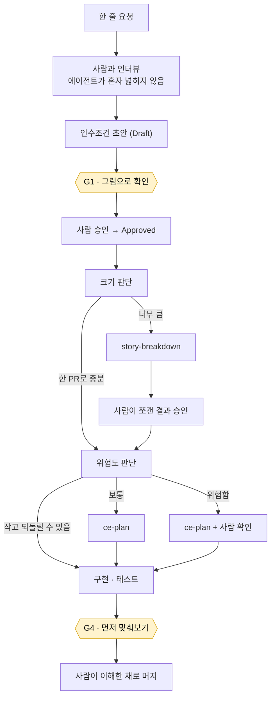

# Plugin Distribution (B) Implementation Plan

> **For agentic workers:** REQUIRED SUB-SKILL: Use superpowers:subagent-driven-development (recommended) or superpowers:executing-plans to implement this plan task-by-task. Steps use checkbox (`- [ ]`) syntax for tracking.

**Goal:** 키트를 Claude Code / Codex 플러그인으로 배포하고, 플러그인이 넣을 수 없는 레포 로컬 파일은 사용자가 호출하는 `workflow-setup`이 멱등하게 써넣게 한다.

**Architecture:** 레포 루트가 곧 플러그인이다(`source: "./"`). 스킬은 `skills/` 한 벌만 두고 Codex 매니페스트가 같은 디렉터리를 가리켜 `.claude`/`.agents` 미러가 사라진다. 레포 로컬 쓰기는 산문이 아니라 **테스트 가능한 스크립트** `workflow-install.sh`가 담당하고, `workflow-setup` SKILL.md는 그것을 부르고 승인을 받는 얇은 래퍼다. 훅이 실행하는 스크립트와 강제 검사기는 레포 `.ai-workflow/bin/`으로 복사된다 — 플러그인 캐시 경로가 버전별이라 구워 넣으면 업데이트마다 조용히 깨지고, 강제가 플러그인 설치에 의존해서도 안 되기 때문이다.

**Tech Stack:** Markdown (skills/docs), Bash 3.2 + awk + jq (install script, tests), JSON (plugin manifests), git

**Spec:** `docs/superpowers/specs/2026-08-27-plugin-distribution-design.md`

## Global Constraints

- 작업 디렉터리는 `/Users/jongkkim/Desktop/ai-workflow-kit`.
- **System bash is 3.2.57.** 연관 배열, `${var^^}`, `mapfile`/`readarray`, `declare -A` 금지. `jq` 1.7.1, `python3`, `perl`, `awk` 사용 가능. `timeout` 바이너리는 **없다** — 타임아웃이 필요하면 `perl -e 'alarm N; exec @ARGV'`.
- 스킬은 `skills/` 아래 **한 벌만** 존재한다. `.agents/skills/` 미러를 만들지 않는다.
- 관리 블록 마커는 정확히 이 형태다. BEGIN 매칭은 **버전 비의존 접두사**로 한다(구버전 블록을 교체해야 하므로):
  - 접두사: `<!-- BEGIN ai-workflow-kit`
  - 종료: `<!-- END ai-workflow-kit -->`
- 레포 로컬 디렉터리 이름은 `.ai-workflow/`. 스킬 이름은 `workflow-setup`. `awk`라는 이름을 쓰지 않는다(유닉스 도구와 혼동).
- 키트 버전은 `v2.6`.
- 테스트는 `PASS n / FAIL n` 형식으로 카운트를 출력한다(기존 `usage-handoff` 스위트는 `n/n passed` 형식을 유지한다 — 건드리지 않는다).
- **회귀 기준선 — 어느 것도 낮아지면 안 된다:**
  - `test-check-understanding.sh` → `PASS 20 / FAIL 0`
  - `test-kit-structure.sh` → `PASS 30 / FAIL 0 / SKIP 0` (Task 7에서 의도적으로 재작성됨)
  - `test-enable-gate-hook.sh` → `PASS 18 / FAIL 0`
  - `usage-handoff/tests/test-enable-hook.sh` → `17/17 passed`
  - `usage-handoff/tests/test-new-handoff.sh` → `16/16 passed`
  - `usage-handoff/tests/test-usage-guard.sh` → `13/13 passed`
- `oliveyoung-test/`는 건드리지 않는다.

## 스펙에서 누락되어 이 계획이 결정한 것

- **`real-work/CLAUDE.md`** — 스펙 §11에 없었다. 이 파일은 `@AGENTS.md`로 AGENTS.md를 import하는데, 이는 원작자가 Claude Code의 AGENTS.md 자동 인식에 의존하지 않았다는 뜻이다. 그 가정이 맞다면 관리 블록을 AGENTS.md에만 넣을 경우 Claude Code에서 1층이 보이지 않는다. 추측하지 않고 **양쪽 파일 모두에 블록을 쓴다**(Task 3).
- **`real-work/optional-v2/second-brain/`** — 스펙의 이동/삭제 목록 어디에도 없다. 흡수 트리에 실린 적도 없다. 삭제하지 않고 `docs/optional-v2/`로 옮긴다(Task 9).

---

### Task 1: 플러그인 매니페스트

**Files:**
- Create: `.claude-plugin/plugin.json`
- Create: `.claude-plugin/marketplace.json`
- Create: `.codex-plugin/plugin.json`
- Create: `.agents/plugins/marketplace.json`

**Interfaces:**
- Consumes: 없음
- Produces: 플러그인 이름 `ai-workflow-kit`, 마켓플레이스 이름 `ai-workflow-kit`, 스킬 루트 `./skills/`. Task 2가 그 디렉터리를 만든다.

- [ ] **Step 1: `.claude-plugin/plugin.json` 작성**

```json
{
  "name": "ai-workflow-kit",
  "version": "2.6.0",
  "description": "Understanding gates for agent-driven work: an eli5-first explainer and a recorded, checkable gate before a human approves a contract or merges a diff.",
  "author": {
    "name": "syjkim0125"
  },
  "homepage": "https://github.com/syjkim0125/ai-workflow-kit",
  "repository": "https://github.com/syjkim0125/ai-workflow-kit",
  "license": "MIT",
  "keywords": [
    "understanding-gates",
    "code-review",
    "comprehension",
    "workflow",
    "acceptance-criteria"
  ]
}
```

- [ ] **Step 2: `.claude-plugin/marketplace.json` 작성**

```json
{
  "name": "ai-workflow-kit",
  "owner": {
    "name": "syjkim0125"
  },
  "metadata": {
    "description": "Understanding gates for Claude Code and Codex",
    "version": "1.0.0"
  },
  "plugins": [
    {
      "name": "ai-workflow-kit",
      "description": "Understanding gates for agent-driven work: an eli5-first explainer and a recorded, checkable gate before a human approves a contract or merges a diff.",
      "author": {
        "name": "syjkim0125"
      },
      "homepage": "https://github.com/syjkim0125/ai-workflow-kit",
      "tags": [
        "understanding-gates",
        "comprehension",
        "code-review",
        "workflow"
      ],
      "source": "./"
    }
  ]
}
```

- [ ] **Step 3: `.codex-plugin/plugin.json` 작성**

`skills` 필드가 Claude 쪽과 **같은 디렉터리**를 가리키는 것이 핵심이다. 미러를 만들지 않는 이유가 이 한 줄이다.

```json
{
  "name": "ai-workflow-kit",
  "version": "2.6.0",
  "description": "Understanding gates for agent-driven work: an eli5-first explainer and a recorded, checkable gate before a human approves a contract or merges a diff.",
  "author": {
    "name": "syjkim0125"
  },
  "homepage": "https://github.com/syjkim0125/ai-workflow-kit",
  "repository": "https://github.com/syjkim0125/ai-workflow-kit",
  "license": "MIT",
  "keywords": [
    "understanding-gates",
    "comprehension",
    "code-review",
    "workflow"
  ],
  "skills": "./skills/"
}
```

- [ ] **Step 4: `.agents/plugins/marketplace.json` 작성**

```json
{
  "name": "ai-workflow-kit",
  "owner": {
    "name": "syjkim0125"
  },
  "metadata": {
    "description": "Understanding gates for Claude Code and Codex",
    "version": "1.0.0"
  },
  "plugins": [
    {
      "name": "ai-workflow-kit",
      "description": "Understanding gates for agent-driven work.",
      "source": "../../"
    }
  ]
}
```

- [ ] **Step 5: JSON 유효성 확인**

```bash
cd /Users/jongkkim/Desktop/ai-workflow-kit
for f in .claude-plugin/plugin.json .claude-plugin/marketplace.json .codex-plugin/plugin.json .agents/plugins/marketplace.json; do
  printf '%-42s ' "$f"; jq -e . "$f" >/dev/null 2>&1 && echo VALID || echo INVALID
done
jq -r '.skills' .codex-plugin/plugin.json
jq -r '.plugins[0].source' .claude-plugin/marketplace.json
```
Expected: 네 줄 모두 `VALID`, `./skills/`, `./`

- [ ] **Step 6: Commit**

```bash
git add .claude-plugin .codex-plugin .agents
git commit -m "feat(plugin): add Claude Code and Codex plugin manifests"
```

---

### Task 2: 스킬을 `skills/`로 이동, 미러 제거, 테스트 경로 산술 수정

**Files:**
- Move: `real-work/.claude/skills/{learning-gate,story-breakdown,usage-handoff}` → `skills/`
- Delete: `real-work/.agents/skills/` (전체)
- Modify: `skills/learning-gate/tests/test-kit-structure.sh` (경로 상수)

**Interfaces:**
- Consumes: Task 1의 `skills/` 규약
- Produces: `skills/learning-gate/`, `skills/story-breakdown/`, `skills/usage-handoff/`. Task 3이 `skills/learning-gate/scripts/*`를 references로 옮긴다.

이 태스크의 목표는 **이동 후에도 6개 스위트가 전부 green**인 것이다. 내용은 바꾸지 않는다.

- [ ] **Step 1: 이동 전 기준선 기록**

```bash
cd /Users/jongkkim/Desktop/ai-workflow-kit
bash real-work/.claude/skills/learning-gate/tests/test-check-understanding.sh | tail -1
bash real-work/.claude/skills/learning-gate/tests/test-kit-structure.sh | tail -1
bash real-work/.claude/skills/learning-gate/tests/test-enable-gate-hook.sh | tail -1
for t in enable-hook new-handoff usage-guard; do
  printf '%-14s ' "$t"
  perl -e 'alarm 150; exec "bash", $ARGV[0]' "real-work/.claude/skills/usage-handoff/tests/test-$t.sh" 2>&1 | tail -1
done
```
Expected: `PASS 20 / FAIL 0`, `PASS 30 / FAIL 0 / SKIP 0`, `PASS 18 / FAIL 0`, `17/17 passed`, `16/16 passed`, `13/13 passed`

- [ ] **Step 2: git mv로 이동**

`git mv`를 쓴다(히스토리 보존, 실행 비트 보존).

```bash
cd /Users/jongkkim/Desktop/ai-workflow-kit
mkdir -p skills
git mv real-work/.claude/skills/learning-gate   skills/learning-gate
git mv real-work/.claude/skills/story-breakdown skills/story-breakdown
git mv real-work/.claude/skills/usage-handoff   skills/usage-handoff
git rm -r -q real-work/.agents
ls skills/
```
Expected: `learning-gate  story-breakdown  usage-handoff`

- [ ] **Step 3: 실행 비트가 살아있는지 확인**

```bash
ls -l skills/learning-gate/scripts/*.sh skills/usage-handoff/scripts/* | awk '{print $1, $NF}'
```
Expected: `.sh` 파일들이 `-rwxr-xr-x`. 아니면 `chmod +x` 로 복구한다.

- [ ] **Step 4: 경로 산술 수정**

`skills/learning-gate/tests/test-kit-structure.sh` 는 현재 `real-work/` 를 겨냥한다:

```bash
KIT="$(cd "$TEST_DIR/../../../.." && pwd -P)"   # -> real-work/
ROOT="$(cd "$KIT/.." && pwd -P)"                # -> kit root
```

새 위치 `skills/learning-gate/tests/` 에서는 세 단계면 레포 루트다. 다음으로 교체:

```bash
KIT="$(cd "$TEST_DIR/../../.." && pwd -P)"      # -> repo root (plugin root)
ROOT="$KIT"                                      # kit root == plugin root now
```

주석도 함께 고친다. `KIT`이 가리키던 `real-work/`는 이제 존재하지 않고, 레포 루트가 그 역할을 겸한다.

- [ ] **Step 5: 이동 후 6개 스위트 재실행**

```bash
cd /Users/jongkkim/Desktop/ai-workflow-kit
bash skills/learning-gate/tests/test-check-understanding.sh | tail -1
bash skills/learning-gate/tests/test-enable-gate-hook.sh | tail -1
for t in enable-hook new-handoff usage-guard; do
  printf '%-14s ' "$t"
  perl -e 'alarm 150; exec "bash", $ARGV[0]' "skills/usage-handoff/tests/test-$t.sh" 2>&1 | tail -1
done
bash skills/learning-gate/tests/test-kit-structure.sh | tail -3
```

`test-check-understanding.sh`, `test-enable-gate-hook.sh`, `usage-handoff` 3종은 **기준선 그대로**여야 한다.

`test-kit-structure.sh`는 **실패한다** — `real-work/` 기준으로 문서 배선을 검사하는데 문서가 아직 안 옮겨졌기 때문이다. 그 실패는 예상된 것이고 Task 6이 이 파일을 재작성한다. 실패한 검사 이름들을 리포트에 적고 진행한다. **다른 다섯 스위트 중 하나라도 떨어지면 멈추고 보고한다.**

- [ ] **Step 6: Commit**

```bash
git add -A skills real-work
git commit -m "refactor(plugin): move skills to skills/, drop the .agents mirror"
```

---

### Task 3: `workflow-install.sh` — 멱등 설치 엔진

**Files:**
- Create: `skills/workflow-setup/scripts/workflow-install.sh`
- Test: `skills/workflow-setup/tests/test-workflow-install.sh`

**Interfaces:**
- Consumes: 없음(references 디렉터리는 인자로 받는다 — Task 4가 채운다)
- Produces:
  `workflow-install.sh --references <dir> [--repo-root <dir>] [--version <v>] [--dry-run] [--remove]`
  - exit 0 = 성공
  - exit 2 = 사용법 오류(인자 누락, references 없음)
  - exit 3 = 거부(마커 짝이 안 맞음 — 추측하지 않는다)
  Task 4의 SKILL.md가 이 CLI를 부른다. Task 7의 구조 테스트가 이 산출물을 검사한다.

이 태스크가 B의 핵심이다. 산문이 아니라 스크립트인 이유: 멱등 블록 편집을 매번 다르게 해석하면 남의 `AGENTS.md`를 망가뜨린다.

- [ ] **Step 1: 실패하는 테스트 작성**

`skills/workflow-setup/tests/test-workflow-install.sh`:

```bash
#!/usr/bin/env bash
# Tests for workflow-install.sh — the idempotent repo-local installer.
#
# Contract under test:
#   1. Fresh repo: writes block, bin/, VERSION, templates/, docs/
#   2. Block is written to BOTH AGENTS.md and CLAUDE.md
#   3. No AGENTS.md at all -> creates it
#   4. Existing AGENTS.md -> content outside the markers is byte-identical after
#   5. Idempotent: running twice leaves exactly one block
#   6. Version bump: an older block is replaced, not duplicated
#   7. Unbalanced markers -> exit 3, nothing written
#   8. --dry-run writes nothing and exits 0
#   9. --remove strips the block and .ai-workflow/, leaves everything else
#  10. Missing --references -> exit 2
#  11. Copied bin/ scripts are executable
#  12. VERSION records the installed version

set -uo pipefail

TEST_DIR="$(cd "$(dirname "${BASH_SOURCE[0]}")" && pwd -P)"
SCRIPT="$TEST_DIR/../scripts/workflow-install.sh"

TMP="$(mktemp -d)"; trap 'rm -rf "$TMP"' EXIT
TMP="$(cd "$TMP" && pwd -P)"

pass=0; fail=0
check() {
  local name="$1" expected="$2" actual="$3"
  if [ "$expected" = "$actual" ]; then
    pass=$((pass+1)); printf '  PASS  %s\n' "$name"
  else
    fail=$((fail+1)); printf '  FAIL  %s\n        expected: %s\n        actual:   %s\n' "$name" "$expected" "$actual"
  fi
}

# --- a minimal references/ tree, standing in for what Task 4 ships ---
REF="$TMP/references"
mkdir -p "$REF/bin" "$REF/templates" "$REF/engineering"
cat > "$REF/agents-block.md" <<'BLOCK'
<!-- BEGIN ai-workflow-kit vTEST — managed; edits inside are overwritten -->
## Engineering lifecycle (ai-workflow-kit)

- Understanding gates are part of approval, not a courtesy.
<!-- END ai-workflow-kit -->
BLOCK
printf '#!/usr/bin/env bash\necho checker\n' > "$REF/bin/check-understanding.sh"
printf '#!/usr/bin/env bash\necho guard\n'   > "$REF/bin/gate-guard.sh"
printf '# T\n' > "$REF/templates/UNDERSTANDING.md"
printf '# W\n' > "$REF/engineering/AI-WORKFLOW.md"

mkrepo() { rm -rf "$1"; mkdir -p "$1"; git -C "$1" init -q; }
run() { bash "$SCRIPT" --references "$REF" --repo-root "$1" --version vTEST "${@:2}" >/dev/null 2>&1; printf '%s' "$?"; }
blocks() { grep -c '<!-- BEGIN ai-workflow-kit' "$1" 2>/dev/null || printf 0; }

# 1 fresh repo
R="$TMP/r1"; mkrepo "$R"
check "fresh install exits 0"        "0"   "$(run "$R")"
check "AGENTS.md has one block"      "1"   "$(blocks "$R/AGENTS.md")"
check "bin/ checker copied"          "yes" "$([ -f "$R/.ai-workflow/bin/check-understanding.sh" ] && echo yes || echo no)"
check "bin/ checker executable"      "yes" "$([ -x "$R/.ai-workflow/bin/check-understanding.sh" ] && echo yes || echo no)"
check "VERSION recorded"             "vTEST" "$(cat "$R/.ai-workflow/VERSION" 2>/dev/null)"
check "template copied"              "yes" "$([ -f "$R/templates/UNDERSTANDING.md" ] && echo yes || echo no)"
check "engineering doc copied"       "yes" "$([ -f "$R/docs/engineering/AI-WORKFLOW.md" ] && echo yes || echo no)"
check "gate artifact dir created"    "yes" "$([ -f "$R/docs/understanding/.gitkeep" ] && echo yes || echo no)"

# 2 both instruction files
check "CLAUDE.md also has the block" "1"   "$(blocks "$R/CLAUDE.md")"

# 4 existing content preserved
# NOTE: awk '!/BEGIN/,/END/' does NOT strip a range — it prints everything, so an
# assertion built on it can never fail. Strip with an explicit state machine.
strip_block() {
  awk -v bp='<!-- BEGIN ai-workflow-kit' -v ep='<!-- END ai-workflow-kit -->' \
    'index($0,bp){inb=1;next} inb&&index($0,ep){inb=0;next} inb{next} {print}' "$1"
}
R="$TMP/r4"; mkrepo "$R"
printf '# My rules\n\n- keep me\n' > "$R/AGENTS.md"
run "$R" >/dev/null
check "first line untouched"          "# My rules" "$(head -1 "$R/AGENTS.md")"
check "user line survives once"       "1"          "$(grep -c 'keep me' "$R/AGENTS.md")"
check "nothing but the block added"   "1"          "$(strip_block "$R/AGENTS.md" | grep -c 'keep me')"
check "no kit text outside the block" "0"          "$(strip_block "$R/AGENTS.md" | grep -c 'ai-workflow-kit')"

# 5 idempotent
check "second run exits 0"           "0"   "$(run "$R")"
check "still exactly one block"      "1"   "$(blocks "$R/AGENTS.md")"

# 6 version bump replaces, does not duplicate
R="$TMP/r6"; mkrepo "$R"
run "$R" >/dev/null
sed -i.bak 's/vTEST/vOLD/' "$R/AGENTS.md" && rm -f "$R/AGENTS.md.bak"
run "$R" >/dev/null
check "old block replaced"           "1"   "$(blocks "$R/AGENTS.md")"
check "new version present"          "1"   "$(grep -c 'vTEST' "$R/AGENTS.md")"
check "old version gone"             "0"   "$(grep -c 'vOLD' "$R/AGENTS.md")"

# 7 unbalanced markers -> refuse, write nothing
R="$TMP/r7"; mkrepo "$R"
printf '# Mine\n<!-- BEGIN ai-workflow-kit vX -->\nstray\n' > "$R/AGENTS.md"
sha_before="$(shasum "$R/AGENTS.md" | cut -d" " -f1)"
check "unbalanced markers exit 3"    "3"   "$(run "$R")"
check "file untouched on refusal"    "$sha_before" "$(shasum "$R/AGENTS.md" | cut -d' ' -f1)"

# 8 dry run
R="$TMP/r8"; mkrepo "$R"
check "--dry-run exits 0"            "0"   "$(run "$R" --dry-run)"
check "--dry-run wrote nothing"      "no"  "$([ -e "$R/AGENTS.md" ] && echo yes || echo no)"

# 9 remove
R="$TMP/r9"; mkrepo "$R"
printf '# Mine\n\n- keep me\n' > "$R/AGENTS.md"
run "$R" >/dev/null
check "--remove exits 0"             "0"   "$(run "$R" --remove)"
check "block gone"                   "0"   "$(blocks "$R/AGENTS.md")"
check "user content kept"            "1"   "$(grep -c 'keep me' "$R/AGENTS.md")"
check ".ai-workflow removed"         "no"  "$([ -d "$R/.ai-workflow" ] && echo yes || echo no)"
check "templates kept on remove"     "yes" "$([ -f "$R/templates/UNDERSTANDING.md" ] && echo yes || echo no)"

# 10 usage error
R="$TMP/r10"; mkrepo "$R"
bash "$SCRIPT" --repo-root "$R" >/dev/null 2>&1
check "missing --references exit 2"  "2"   "$?"

printf '\nPASS %d / FAIL %d\n' "$pass" "$fail"
[ "$fail" -eq 0 ]
```

- [ ] **Step 2: 테스트가 실패하는지 확인**

```bash
cd /Users/jongkkim/Desktop/ai-workflow-kit
bash skills/workflow-setup/tests/test-workflow-install.sh
```
Expected: 스크립트가 없으므로 대부분 FAIL. 마지막 줄의 FAIL 수가 0이 아님을 확인한다(정확한 수는 상관없다 — 파일 부재로 통과하는 부정 검사가 몇 개 있다).

- [ ] **Step 3: 구현**

`skills/workflow-setup/scripts/workflow-install.sh`:

```bash
#!/usr/bin/env bash
# Install, update, or remove the ai-workflow-kit repo-local footprint.
#
# A plugin cannot write into a target repository, and the kit's enforcement
# lives in files that must be there: the always-on rules an agent reads at the
# repo root, the gate artifacts, and the checker that CI or a teammate without
# the plugin still has to be able to run. This script writes exactly those.
#
# Usage:
#   workflow-install.sh --references <dir> [--repo-root <dir>] [--version <v>]
#                       [--dry-run] [--remove]
#
# Exit codes:
#   0  done
#   2  usage error
#   3  refused — the target's markers are unbalanced; not guessing

set -uo pipefail

BEGIN_PAT='<!-- BEGIN ai-workflow-kit'
END_PAT='<!-- END ai-workflow-kit -->'

REFS=""; ROOT=""; VERSION="v2.6"; DRY=0; REMOVE=0

need_value() { [ $# -ge 2 ] || { printf 'missing value for %s\n' "$1" >&2; exit 2; }; }

while [ $# -gt 0 ]; do
  case "$1" in
    --references) need_value "$@"; REFS="$2"; shift 2 ;;
    --repo-root)  need_value "$@"; ROOT="$2"; shift 2 ;;
    --version)    need_value "$@"; VERSION="$2"; shift 2 ;;
    --dry-run)    DRY=1; shift ;;
    --remove)     REMOVE=1; shift ;;
    -h|--help)    sed -n '2,18p' "$0"; exit 0 ;;
    *) printf 'unknown argument: %s\n' "$1" >&2; exit 2 ;;
  esac
done

if [ -z "$ROOT" ]; then
  ROOT="$(git rev-parse --show-toplevel 2>/dev/null)" || ROOT="$PWD"
fi
[ -d "$ROOT" ] || { printf 'repo root not a directory: %s\n' "$ROOT" >&2; exit 2; }

if [ "$REMOVE" -eq 0 ]; then
  [ -n "$REFS" ] && [ -d "$REFS" ] || {
    printf 'references directory required and must exist (--references)\n' >&2; exit 2; }
  [ -f "$REFS/agents-block.md" ] || {
    printf 'references missing agents-block.md: %s\n' "$REFS" >&2; exit 2; }
fi

INSTR_FILES="AGENTS.md CLAUDE.md"

# Refuse before writing anything if any target's markers are unbalanced.
for name in $INSTR_FILES; do
  f="$ROOT/$name"
  [ -f "$f" ] || continue
  b=$(grep -c "$BEGIN_PAT" "$f" 2>/dev/null || true); b=${b:-0}
  e=$(grep -c "$END_PAT" "$f" 2>/dev/null || true);   e=${e:-0}
  if [ "$b" != "$e" ] || [ "$b" -gt 1 ]; then
    printf 'refusing: %s has %s BEGIN and %s END markers (expected 0/0 or 1/1)\n' "$name" "$b" "$e" >&2
    exit 3
  fi
done

say() { [ "$DRY" -eq 1 ] && printf '[dry-run] %s\n' "$*" || printf '%s\n' "$*"; }

strip_block() {  # $1=file -> stdout without the managed block
  awk -v bp="$BEGIN_PAT" -v ep="$END_PAT" '
    index($0, bp) { inb=1; next }
    inb && index($0, ep) { inb=0; next }
    inb { next }
    { print }
  ' "$1"
}

apply_block() {  # $1=file  $2=blockfile
  local f="$1" bf="$2" tmp
  tmp="$(mktemp)"
  if [ -f "$f" ] && grep -q "$BEGIN_PAT" "$f" 2>/dev/null; then
    awk -v bp="$BEGIN_PAT" -v ep="$END_PAT" -v bfile="$bf" '
      BEGIN { while ((getline l < bfile) > 0) blk = blk l "\n" }
      index($0, bp) { inb=1; printf "%s", blk; next }
      inb && index($0, ep) { inb=0; next }
      inb { next }
      { print }
    ' "$f" > "$tmp"
  elif [ -f "$f" ]; then
    { cat "$f"; printf '\n'; cat "$bf"; } > "$tmp"
  else
    cat "$bf" > "$tmp"
  fi
  if [ "$DRY" -eq 1 ]; then
    printf '[dry-run] would write %s:\n' "$f"
    diff -u "${f:-/dev/null}" "$tmp" 2>/dev/null | sed 's/^/    /' || true
    rm -f "$tmp"
  else
    mv "$tmp" "$f"
  fi
}

if [ "$REMOVE" -eq 1 ]; then
  for name in $INSTR_FILES; do
    f="$ROOT/$name"
    [ -f "$f" ] || continue
    grep -q "$BEGIN_PAT" "$f" 2>/dev/null || continue
    if [ "$DRY" -eq 1 ]; then say "would strip block from $name"; else
      tmp="$(mktemp)"; strip_block "$f" > "$tmp"; mv "$tmp" "$f"; say "stripped block from $name"
    fi
  done
  if [ "$DRY" -eq 1 ]; then say "would remove .ai-workflow/"; else
    rm -rf "$ROOT/.ai-workflow"; say "removed .ai-workflow/"
  fi
  say "templates/, docs/engineering/, and docs/understanding/ were left in place"
  exit 0
fi

# 1. managed block in both instruction files
for name in $INSTR_FILES; do
  apply_block "$ROOT/$name" "$REFS/agents-block.md"
  say "block applied to $name"
done

# 2. hook-invoked scripts + the enforcement checker
if [ "$DRY" -eq 0 ]; then
  mkdir -p "$ROOT/.ai-workflow/bin"
  if [ -d "$REFS/bin" ]; then
    cp "$REFS"/bin/* "$ROOT/.ai-workflow/bin/" 2>/dev/null || true
    chmod +x "$ROOT"/.ai-workflow/bin/*.sh 2>/dev/null || true
  fi
  printf '%s\n' "$VERSION" > "$ROOT/.ai-workflow/VERSION"
fi
say ".ai-workflow/bin populated, VERSION=$VERSION"

# 3-5. templates, engineering docs, gate artifact dir
if [ "$DRY" -eq 0 ]; then
  [ -d "$REFS/templates" ] && { mkdir -p "$ROOT/templates"; cp "$REFS"/templates/*.md "$ROOT/templates/" 2>/dev/null || true; }
  [ -d "$REFS/engineering" ] && { mkdir -p "$ROOT/docs/engineering"; cp "$REFS"/engineering/*.md "$ROOT/docs/engineering/" 2>/dev/null || true; }
  mkdir -p "$ROOT/docs/understanding"; : > "$ROOT/docs/understanding/.gitkeep"
fi
say "templates/, docs/engineering/, docs/understanding/ ready"

exit 0
```

- [ ] **Step 4: 테스트 통과 확인**

```bash
cd /Users/jongkkim/Desktop/ai-workflow-kit
chmod +x skills/workflow-setup/scripts/workflow-install.sh
bash skills/workflow-setup/tests/test-workflow-install.sh
```
Expected: 마지막 줄 `PASS 28 / FAIL 0`, exit 0.

카운트가 28이 아니면 테스트의 `check` 호출 수를 세어 보고하고, 테스트를 고쳐 맞추지 말 것.

- [ ] **Step 5: 음성 대조 — 멱등성 검사가 실제로 실패할 수 있는지 증명**

`apply_block`의 교체 분기를 임시로 무력화(항상 append 하도록)한 뒤 스위트를 돌려 멱등성 검사가 FAIL 하는지 확인하고, 되돌린 뒤 다시 green인지 확인한다. 두 실행 결과를 붙여넣는다.

- [ ] **Step 6: Commit**

```bash
git add skills/workflow-setup
git commit -m "feat(workflow-setup): add idempotent repo-local installer with tests"
```

---

### Task 4: `workflow-setup` 스킬과 references 채우기

**Files:**
- Create: `skills/workflow-setup/SKILL.md`
- Create: `skills/workflow-setup/references/agents-block.md`
- Move: `skills/learning-gate/scripts/{check-understanding.sh,gate-guard.sh,enable-gate-hook.sh}` → `skills/workflow-setup/references/bin/`
- Move: `skills/usage-handoff/scripts/{usage-guard.sh,enable-hook.sh}` → `skills/workflow-setup/references/bin/`
- Move: `real-work/templates/*.md` → `skills/workflow-setup/references/templates/`
- Move: `real-work/docs/engineering/*.md` → `skills/workflow-setup/references/engineering/`
- Modify: `skills/learning-gate/tests/test-check-understanding.sh`, `test-enable-gate-hook.sh` (스크립트 경로)
- Modify: `skills/usage-handoff/tests/test-enable-hook.sh`, `test-usage-guard.sh` (스크립트 경로)

**Interfaces:**
- Consumes: `workflow-install.sh --references <dir>` (Task 3)
- Produces: 스킬 이름 `workflow-setup`, references 레이아웃 `bin/ templates/ engineering/ agents-block.md`. Task 6의 문서가 `.ai-workflow/bin/` 경로를 참조한다.

- [ ] **Step 1: references 디렉터리 구성**

```bash
cd /Users/jongkkim/Desktop/ai-workflow-kit
mkdir -p skills/workflow-setup/references/bin skills/workflow-setup/references/templates skills/workflow-setup/references/engineering
git mv skills/learning-gate/scripts/check-understanding.sh skills/workflow-setup/references/bin/
git mv skills/learning-gate/scripts/gate-guard.sh          skills/workflow-setup/references/bin/
git mv skills/learning-gate/scripts/enable-gate-hook.sh    skills/workflow-setup/references/bin/
git mv skills/usage-handoff/scripts/usage-guard.sh         skills/workflow-setup/references/bin/
git mv skills/usage-handoff/scripts/enable-hook.sh         skills/workflow-setup/references/bin/
git mv real-work/templates/*.md            skills/workflow-setup/references/templates/
git mv real-work/docs/engineering/*.md     skills/workflow-setup/references/engineering/
rmdir skills/learning-gate/scripts 2>/dev/null
ls skills/workflow-setup/references/bin/
```
Expected: 다섯 스크립트가 나열됨.

`skills/usage-handoff/scripts/` 에는 `new-handoff.sh`, `usage.py`, `usage-refresh.py` 가 남는다 — 훅이 아니라 스킬이 실행하므로 플러그인에 잔류한다.

- [ ] **Step 2: 이동한 스크립트를 가리키던 테스트 경로 수정**

네 테스트 파일이 `../scripts/<name>` 로 형제 스크립트를 찾는다. 이제 스크립트는 `skills/workflow-setup/references/bin/` 에 있으므로 경로를 고친다.

- `skills/learning-gate/tests/test-check-understanding.sh`
  `SCRIPT="$TEST_DIR/../scripts/check-understanding.sh"`
  → `SCRIPT="$TEST_DIR/../../workflow-setup/references/bin/check-understanding.sh"`

- `skills/learning-gate/tests/test-enable-gate-hook.sh`
  `ENABLE="$TEST_DIR/../scripts/enable-gate-hook.sh"` → `ENABLE="$TEST_DIR/../../workflow-setup/references/bin/enable-gate-hook.sh"`
  `GUARD="$TEST_DIR/../scripts/gate-guard.sh"`        → `GUARD="$TEST_DIR/../../workflow-setup/references/bin/gate-guard.sh"`

- `skills/usage-handoff/tests/test-enable-hook.sh` 와 `test-usage-guard.sh`
  같은 방식으로 `usage-guard.sh` / `enable-hook.sh` 를 `../../workflow-setup/references/bin/` 로 돌린다. 이 두 파일은 스크립트를 찾는 방식이 다를 수 있으니 **먼저 열어서 실제 변수명을 확인한 뒤** 고친다.

`gate-guard.sh` 의 형제 경로 해석(`${BASH_SOURCE[0]}` 기반)은 그대로 유효하다 — `check-understanding.sh` 가 같은 `bin/` 안에 있기 때문이다. 그 로직은 건드리지 않는다.

- [ ] **Step 3: 네 스위트가 기준선을 유지하는지 확인**

```bash
cd /Users/jongkkim/Desktop/ai-workflow-kit
bash skills/learning-gate/tests/test-check-understanding.sh | tail -1
bash skills/learning-gate/tests/test-enable-gate-hook.sh | tail -1
for t in enable-hook usage-guard new-handoff; do
  printf '%-14s ' "$t"
  perl -e 'alarm 150; exec "bash", $ARGV[0]' "skills/usage-handoff/tests/test-$t.sh" 2>&1 | tail -1
done
```
Expected: `PASS 20 / FAIL 0`, `PASS 18 / FAIL 0`, `17/17 passed`, `13/13 passed`, `16/16 passed`

- [ ] **Step 4: `references/agents-block.md` 작성**

정확히 이 내용. 원칙 8종은 옛 `real-work/AGENTS.md` 에서 **한 글자도 바꾸지 않고** 옮긴 것이며,
`##` 이 `###` 으로 한 단계 내려간 것만 다르다(블록이 두 부분으로 읽히게).

````markdown
<!-- BEGIN ai-workflow-kit v2.6 — managed; edits inside are overwritten -->
## Engineering Operating Principles (ai-workflow-kit)

These are always-on. Keep project-specific build commands, architecture rules,
security policies, and conventions alongside them.

### Evidence before assumption
- Inspect the task, current code, tests, config, schema, build files, and relevant docs before deciding how the system works.
- Resolve uncertainty from available evidence first. Ask only about material ambiguity that cannot be resolved safely.
- Memory and prior solutions are navigation aids; current executable evidence wins when they conflict.

### Simplest durable implementation
- Choose the simplest implementation that satisfies known requirements and real existing contracts.
- Do not add abstractions, configurability, packages, or future-proofing solely for hypothetical reuse.
- Introduce an abstraction when it protects a real boundary, invariant, or meaningful complexity.
- Prefer small end-to-end working slices over speculative platform work.

### Surgical change
- Prefer extending existing patterns over creating parallel architectures.
- Every changed line should be necessary for the requested outcome, repository consistency, or verification.
- Avoid unrelated refactors. Remove obsolete/orphaned code caused by the change only when safe.

### Dependencies and retrieval
- Prefer capabilities already provided by the repository and its dependencies before adding packages or custom implementations.
- Verify the installed version. Check local types/source or version-matched documentation before assuming a library does or does not support a capability.

### Compatibility boundary
- Do not add backward-compatibility layers by default.
- Preserve or deliberately migrate compatibility when a released API, persisted data/schema/event, external consumer, or explicit migration requirement makes it real.
- Internal/unreleased obsolete paths may be removed rather than preserved through shims.

### Debugging discipline
- Reproduce and trace failures before proposing a fix.
- Prefer a root-cause fix over a symptom-masking workaround.
- Add regression evidence for material bugs when practical.

### Goal-backward verification
- Define observable success before or during implementation: what must be true if the task is actually done?
- Translate the requirement into a compact acceptance checklist of independently verifiable behaviors — including what must NOT happen — then verify each item. Fix recurring failures in response to patterns across runs, never off a single failing run.
- Verify with fresh tests/build/static checks/runtime evidence appropriate to the change.
- Do not claim completion from reasoning alone when executable verification is available.

### Explained completion
- A change no human can understand is not done: explain it or don't ship it — someone must understand the change well enough to defend it.
- Finish every non-trivial task with an explainer, structure first: how the change is organized, a one-line summary per part, then code details last — plus verification actually run with results, and remaining assumptions or risks. Writing the explainer doubles as a bug sweep.
- Review is comprehension, not approval: the reviewer should be able to explain the change afterward. When generated code outpaces understanding, run the `learning-gate` skill — it produces the eli5-first understanding artifact and records it, per `templates/UNDERSTANDING.md` — and re-split the task when it exceeds one reviewable unit.

## Engineering lifecycle (ai-workflow-kit)

- Compound Engineering is this repository's primary lifecycle for every agent
  runtime. This repository-level default takes precedence over global or
  user-level workflow preferences.
- Understanding gates are part of approval, not a courtesy. Before an Acceptance
  contract moves `Draft` → `Approved` run `learning-gate acceptance` (G1). Before
  a PR merges run `learning-gate diff` (G4) or record its `N/A` form. High-risk
  plan checkpoints use `learning-gate plan` (G3); a Story split into two or more
  Tasks uses `learning-gate story` (G5) at integration review.
- A gate is satisfied by evidence, not by assertion. Each gate writes its
  artifact to `docs/understanding/` and one record line into the canonical
  Acceptance artifact. Verify with
  `bash .ai-workflow/bin/check-understanding.sh --gate <G1|G3|G4|G5> --contract <path>`
  and report the exit code. Without a valid G1 line the contract stays `Draft`;
  without a valid G4 line the PR does not merge.
- Story sizing: if an approved Story is already one coherent, independently
  reviewable PR-sized unit, do not split it. Otherwise run `story-breakdown`.
- Right-size by risk: small/reversible → inspect, implement, focused verify;
  normal → CE plan → CE work → right-sized review; high-risk → add an explicit
  human plan checkpoint.
- Superpowers: explicit opt-in only. Do not invoke it merely because a skill is
  discoverable or looks relevant.

Repository knowledge: `templates/UNDERSTANDING.md` (gate contract) ·
`docs/understanding/` (gate artifacts) · `templates/` (requirement templates) ·
`docs/engineering/AI-WORKFLOW.md` (full lifecycle) · `docs/solutions/` when present.
<!-- END ai-workflow-kit -->
````

- [ ] **Step 5: `skills/workflow-setup/SKILL.md` 작성**

```markdown
---
name: workflow-setup
description: Install, update, or remove the ai-workflow-kit footprint in this repository — the always-on rules block, the gate checker and hook scripts, the requirement templates, and the gate artifact directory. Use when the user types /workflow-setup, or after updating the plugin.
disable-model-invocation: true
---

# Workflow Setup

A plugin cannot write into a target repository, but the kit's enforcement lives
in files that must be there: the rules an agent reads at the repo root, the gate
artifacts, and a checker that CI or a teammate without the plugin can still run.
This skill puts them there and keeps them current.

## What it writes

Exactly five things, and nothing else:

1. A managed block in `AGENTS.md` and `CLAUDE.md`
2. `.ai-workflow/bin/` — the gate checker and the hook-invoked scripts
3. `.ai-workflow/VERSION` — the installed kit version
4. `templates/*.md` and `docs/engineering/*.md`
5. `docs/understanding/.gitkeep`

The managed block is delimited by markers. Content outside them is never
touched. If a file's markers are unbalanced the installer refuses and writes
nothing rather than guessing.

## Run it

Set `SKILL_DIR` to the absolute directory you loaded this SKILL.md from — the
Bash tool's working directory is the user's project, not the skill directory, so
a bare relative path will not resolve.

Always preview first:

```bash
SKILL_DIR="<absolute path of the directory containing this SKILL.md>";
bash "$SKILL_DIR/scripts/workflow-install.sh" \
  --references "$SKILL_DIR/references" --dry-run
```

Show the user the diff. Ask for approval with the platform's blocking question
tool (`AskUserQuestion` in Claude Code; call `ToolSearch` with
`select:AskUserQuestion` first if its schema is not loaded). Never write without
an explicit yes.

On approval, drop `--dry-run`. Report the exit code.

To remove: add `--remove`. It strips the block and `.ai-workflow/`, and leaves
`templates/`, `docs/engineering/`, and `docs/understanding/` in place — those may
carry the user's own work.

## After a plugin update

`/plugin update` refreshes the skills; it cannot refresh what lives in the repo.
Re-run this skill. Compare `.ai-workflow/VERSION` against the plugin version and
tell the user when they differ.

## Boundaries

- Never edit outside the markers.
- Never write without showing the diff and getting a yes.
- Do not add the block to a file the user did not agree to touch.
- This skill installs; it does not run gates. That is `learning-gate`.
```

- [ ] **Step 6: 실제 references로 엔드투엔드 확인**

```bash
cd /Users/jongkkim/Desktop/ai-workflow-kit
T=$(mktemp -d); git -C "$T" init -q
printf '# House rules\n\n- do not touch me\n' > "$T/AGENTS.md"
bash skills/workflow-setup/scripts/workflow-install.sh \
  --references skills/workflow-setup/references --repo-root "$T" --version v2.6
echo "exit=$?"
find "$T" -type f -not -path '*/.git/*' | sort
grep -c 'do not touch me' "$T/AGENTS.md"
bash "$T/.ai-workflow/bin/check-understanding.sh" --gate G1 --contract "$T/AGENTS.md" >/dev/null 2>&1
echo "copied checker runs, exit=$? (1 = no record line, correct)"
rm -rf "$T"
```
Expected: exit 0, 다섯 산출물 존재, 기존 문장 1회 유지, 복사된 검사기가 exit 1(기록 줄 없음 — 올바른 동작).

- [ ] **Step 7: Commit**

```bash
git add -A skills real-work
git commit -m "feat(workflow-setup): add setup skill and populate references"
```

---

### Task 5: 하드코딩 경로 재배선

**Files:**
- Modify: `skills/workflow-setup/references/engineering/AI-WORKFLOW.md`
- Modify: `skills/workflow-setup/references/engineering/AI-SETUP.md`
- Modify: `skills/workflow-setup/references/templates/UNDERSTANDING.md`
- Modify: `skills/learning-gate/SKILL.md`
- Modify: `skills/workflow-setup/references/bin/enable-hook.sh` (usage-handoff 훅 경로)
- Modify: `skills/usage-handoff/SKILL.md` (경로 언급이 있으면)

**Interfaces:**
- Consumes: `.ai-workflow/bin/` 규약 (Task 3/4)
- Produces: 문서와 스크립트가 실재하는 레포 경로를 가리킨다. Task 6의 구조 테스트가 이를 검사한다.

- [ ] **Step 1: 남아있는 하드코딩 경로 전수 조사**

```bash
cd /Users/jongkkim/Desktop/ai-workflow-kit
grep -rn '\.claude/skills/learning-gate\|\.claude/skills/usage-handoff' \
  --include='*.md' --include='*.sh' . | grep -v '^./docs/superpowers' | grep -v '^./real-work'
```
찾아낸 모든 곳을 아래 규칙으로 고친다. 조사 결과를 리포트에 그대로 붙여넣는다.

- [ ] **Step 2: 문서의 검사기 경로 교체**

`.claude/skills/learning-gate/scripts/check-understanding.sh` → `.ai-workflow/bin/check-understanding.sh`
`.claude/skills/learning-gate/scripts/enable-gate-hook.sh` → `.ai-workflow/bin/enable-gate-hook.sh`
`.claude/skills/learning-gate/scripts/` (디렉터리 언급) → `.ai-workflow/bin/`

`skills/learning-gate/SKILL.md` 의 "Both runtimes run the single copy under
`.claude/skills/learning-gate/scripts/`." 문장은 이제 사실이 아니다 — 스킬은 플러그인에,
스크립트는 레포에 있다. 정확히 다음으로 교체한다:

```text
The checker is installed into this repository at `.ai-workflow/bin/` by
`/workflow-setup`, so it runs without the plugin — CI and teammates who have not
installed it can still verify a gate.
```

- [ ] **Step 3: `usage-handoff` 훅 경로 교체**

`skills/workflow-setup/references/bin/enable-hook.sh` 의 다음 줄:

```bash
guard='bash "$(git rev-parse --show-toplevel)/.claude/skills/usage-handoff/scripts/usage-guard.sh"'
```

를 `.ai-workflow/bin/usage-guard.sh` 를 가리키도록 바꾼다:

```bash
guard='bash "$(git rev-parse --show-toplevel)/.ai-workflow/bin/usage-guard.sh"'
```

- [ ] **Step 4: 재배선 후 테스트**

```bash
cd /Users/jongkkim/Desktop/ai-workflow-kit
bash skills/learning-gate/tests/test-check-understanding.sh | tail -1
bash skills/learning-gate/tests/test-enable-gate-hook.sh | tail -1
for t in enable-hook usage-guard new-handoff; do
  printf '%-14s ' "$t"
  perl -e 'alarm 150; exec "bash", $ARGV[0]' "skills/usage-handoff/tests/test-$t.sh" 2>&1 | tail -1
done
grep -rn '\.claude/skills/' --include='*.md' --include='*.sh' . | grep -v '^./docs/superpowers' | grep -v '^./real-work' | wc -l
```
Expected: 기준선 유지(`PASS 20`, `PASS 18`, `17/17`, `13/13`, `16/16`), 마지막 grep 카운트 `0`.

`test-enable-hook.sh` 가 옛 경로를 문자열로 단언하고 있다면 그 단언도 새 경로로 고친다 — 테스트가 옛 배선을 고정하고 있으면 안 된다.

- [ ] **Step 5: 실제로 설치해서 훅 경로가 유효한지 확인**

```bash
cd /Users/jongkkim/Desktop/ai-workflow-kit
T=$(mktemp -d); git -C "$T" init -q
bash skills/workflow-setup/scripts/workflow-install.sh --references skills/workflow-setup/references --repo-root "$T" --version v2.6 >/dev/null
( cd "$T" && bash .ai-workflow/bin/enable-gate-hook.sh --contract AGENTS.md >/dev/null 2>&1 )
jq -r '.hooks.PreToolUse[].hooks[].command' "$T/.claude/settings.local.json"
rm -rf "$T"
```
Expected: 방출된 명령이 `.ai-workflow/bin/gate-guard.sh` 를 가리킨다.

명령이 여전히 `.claude/skills/...` 를 가리키면 `enable-gate-hook.sh` 내부에도 경로가 있는 것이므로 함께 고친다.

- [ ] **Step 6: Commit**

```bash
git add -A skills
git commit -m "fix(paths): point docs and hooks at .ai-workflow/bin"
```

---

### Task 6: 구조 테스트 역할 전환

**Files:**
- Rewrite: `skills/learning-gate/tests/test-kit-structure.sh`

**Interfaces:**
- Consumes: `workflow-install.sh` (Task 3), references 레이아웃 (Task 4)
- Produces: 없음(회귀 방지 전용)

지금까지 이 스위트는 키트 자체 정합성을 봤다. 미러가 사라졌으니 `cmp` 검사 2개는 검사할 대상이 없다. 이제 **설치 결과**를 검사한다.

- [ ] **Step 1: 재작성**

`skills/learning-gate/tests/test-kit-structure.sh` 전체를 다음으로 교체한다.

```bash
#!/usr/bin/env bash
# Structural checks for the plugin and for what workflow-install.sh produces.
#
# The kit's known failure mode is a target repo that ends up half-installed or
# drifted. This suite installs into a throwaway repo and inspects the result.
#
# Contract under test:
#   1. Plugin manifests exist and are valid JSON
#   2. The Codex manifest points at the same skills/ directory (no mirror)
#   3. No .agents/skills mirror exists anywhere
#   4. Every shipped skill has a SKILL.md with frontmatter
#   5. references/ carries agents-block.md, bin/, templates/, engineering/
#   6. A fresh install produces all five artifacts
#   7. The install is idempotent
#   8. The copied checker actually runs in the target repo
#   9. --remove strips the block and .ai-workflow/ and keeps the rest
#  10. Docs carry no stale .claude/skills/ paths

set -uo pipefail

TEST_DIR="$(cd "$(dirname "${BASH_SOURCE[0]}")" && pwd -P)"
ROOT="$(cd "$TEST_DIR/../../.." && pwd -P)"     # repo root == plugin root

pass=0; fail=0
check() {
  local name="$1" expected="$2" actual="$3"
  if [ "$expected" = "$actual" ]; then
    pass=$((pass+1)); printf '  PASS  %s\n' "$name"
  else
    fail=$((fail+1)); printf '  FAIL  %s\n        expected: %s\n        actual:   %s\n' "$name" "$expected" "$actual"
  fi
}
exists() { [ -e "$1" ] && printf yes || printf no; }
validjson() { jq -e . "$1" >/dev/null 2>&1 && printf yes || printf no; }
# NOTE: `grep -c PAT file || printf 0` double-fires — grep -c prints "0" on zero
# matches but still exits 1, so the || runs too and you get "0\n0". Capture first.
count() { local c; c="$(grep -c "$1" "$2" 2>/dev/null)"; printf '%s' "${c:-0}"; }

# 1-2 manifests
for m in .claude-plugin/plugin.json .claude-plugin/marketplace.json .codex-plugin/plugin.json .agents/plugins/marketplace.json; do
  check "manifest present: $m" "yes" "$(exists "$ROOT/$m")"
  check "manifest valid json: $m" "yes" "$(validjson "$ROOT/$m")"
done
check "codex points at shared skills dir" "./skills/" "$(jq -r '.skills' "$ROOT/.codex-plugin/plugin.json" 2>/dev/null)"
check "marketplace source is repo root"   "./"        "$(jq -r '.plugins[0].source' "$ROOT/.claude-plugin/marketplace.json" 2>/dev/null)"

# 3 no mirror
check "no .agents/skills mirror" "no" "$(exists "$ROOT/.agents/skills")"
check "real-work is gone"        "no" "$(exists "$ROOT/real-work")"

# 4 skills
for s in learning-gate story-breakdown usage-handoff workflow-setup; do
  check "skill present: $s" "yes" "$(exists "$ROOT/skills/$s/SKILL.md")"
  check "skill frontmatter: $s" "---" "$(head -1 "$ROOT/skills/$s/SKILL.md" 2>/dev/null)"
done

# 5 references
REF="$ROOT/skills/workflow-setup/references"
for r in agents-block.md bin templates engineering; do
  check "references has $r" "yes" "$(exists "$REF/$r")"
done
check "references bin has the checker" "yes" "$(exists "$REF/bin/check-understanding.sh")"

# 6-9 install into a throwaway repo
T="$(mktemp -d)"; trap 'rm -rf "$T"' EXIT
git -C "$T" init -q
printf '# House rules\n\n- do not touch me\n' > "$T/AGENTS.md"
bash "$ROOT/skills/workflow-setup/scripts/workflow-install.sh" \
  --references "$REF" --repo-root "$T" --version vTEST >/dev/null 2>&1
check "install exit 0" "0" "$?"
check "block in AGENTS.md"      "1"   "$(count '<!-- BEGIN ai-workflow-kit' "$T/AGENTS.md")"
check "block in CLAUDE.md"      "1"   "$(count '<!-- BEGIN ai-workflow-kit' "$T/CLAUDE.md")"
check "user content preserved"  "1"   "$(count 'do not touch me' "$T/AGENTS.md")"
check "bin installed"           "yes" "$(exists "$T/.ai-workflow/bin/check-understanding.sh")"
check "VERSION written"         "vTEST" "$(cat "$T/.ai-workflow/VERSION" 2>/dev/null)"
check "templates installed"     "yes" "$(exists "$T/templates/UNDERSTANDING.md")"
check "gate artifact dir"       "yes" "$(exists "$T/docs/understanding/.gitkeep")"

bash "$ROOT/skills/workflow-setup/scripts/workflow-install.sh" \
  --references "$REF" --repo-root "$T" --version vTEST >/dev/null 2>&1
check "idempotent: one block"   "1"   "$(count '<!-- BEGIN ai-workflow-kit' "$T/AGENTS.md")"

bash "$T/.ai-workflow/bin/check-understanding.sh" --gate G1 --contract "$T/AGENTS.md" --repo-root "$T" >/dev/null 2>&1
check "copied checker runs (1=no record line)" "1" "$?"

bash "$ROOT/skills/workflow-setup/scripts/workflow-install.sh" \
  --references "$REF" --repo-root "$T" --remove >/dev/null 2>&1
check "remove: block gone"      "0"   "$(count '<!-- BEGIN ai-workflow-kit' "$T/AGENTS.md")"
check "remove: user content kept" "1" "$(count 'do not touch me' "$T/AGENTS.md")"
check "remove: .ai-workflow gone" "no" "$(exists "$T/.ai-workflow")"
check "remove: templates kept"    "yes" "$(exists "$T/templates/UNDERSTANDING.md")"

# 10 no stale paths in shipped docs
stale=$(grep -rl '\.claude/skills/' "$ROOT/skills" 2>/dev/null | wc -l | tr -d ' ')
check "no stale .claude/skills paths in skills/" "0" "$stale"

printf '\nPASS %d / FAIL %d\n' "$pass" "$fail"
[ "$fail" -eq 0 ]
```

- [ ] **Step 2: 실행**

```bash
cd /Users/jongkkim/Desktop/ai-workflow-kit
bash skills/learning-gate/tests/test-kit-structure.sh | tail -3
```

`real-work is gone` 검사는 Task 8까지 FAIL 한다(아직 디렉터리가 남아 있다). 그 하나만 FAIL 하는지 확인하고, 다른 FAIL이 있으면 그 항목이 가리키는 태스크로 돌아가 고친다. 실패 목록을 리포트에 적는다.

- [ ] **Step 3: Commit**

```bash
git add skills/learning-gate/tests/test-kit-structure.sh
git commit -m "test: retarget structure suite at workflow-install output"
```

---

### Task 7: README 3층 보강과 README-FIRST 재작성

**Files:**
- Modify: `README.md`
- Rewrite: `README-FIRST.md`

**Interfaces:**
- Consumes: `/workflow-setup` 사용법 (Task 4)
- Produces: 없음

- [ ] **Step 1: `README.md` 1층 정확성 수정**

현재 mermaid 노드 B는 `무엇을 만들지 정하고 보여줌` 인데, 에이전트가 혼자 정하고 통보하는 것처럼 읽힌다. `AI-WORKFLOW.md` 는 정반대를 규정한다 — *"Do not silently expand it… interview the requester"*.

노드 B를 사람과의 대화가 드러나게 고친다. 전문용어는 계속 쓰지 않는다(1층 규칙). 예: `사람과 이야기하며 무엇을 만들지 정함`.

- [ ] **Step 2: `README.md` 2층 추가**

`## 다섯 문장` 과 `## 노란 상자(게이트)가 하는 일` 사이에 새 섹션을 넣는다:

````markdown
## 전체 흐름

위 그림은 게이트 두 개만 보여줍니다. 실제로는 이런 순서입니다.



사람이 판단하는 지점은 네 곳입니다: 인수조건 승인, 쪼갠 결과 승인, 위험한 작업의 계획 확인, 그리고 머지.
````

- [ ] **Step 3: `README.md` 3층(시작하기) 교체**

수동 복사 안내를 플러그인 설치 안내로 바꾼다:

````markdown
## 시작하기

```text
한 번만    /plugin marketplace add syjkim0125/ai-workflow-kit
           /plugin install ai-workflow-kit

레포마다   /workflow-setup

업데이트   /plugin update  →  /workflow-setup 다시 실행
```

`/workflow-setup` 은 레포에 다섯 가지만 씁니다: `AGENTS.md`/`CLAUDE.md` 안의 관리 블록,
`.ai-workflow/bin/`(게이트 검사기와 훅 스크립트), `.ai-workflow/VERSION`,
`templates/`와 `docs/engineering/`, 그리고 `docs/understanding/`.
쓰기 전에 diff를 보여주고 물어봅니다. 마커 바깥은 건드리지 않습니다.
````

기존 링크 표는 유지하되 `README-FIRST.md` 설명을 갱신한다.

- [ ] **Step 4: `README-FIRST.md` 재작성**

현재 내용(파일을 손으로 복사하라)은 더 이상 맞지 않다. 다음을 담아 다시 쓴다:

- 버전 배너 `# AI Workflow Kit v2.6 — Start Here`, `Updated: 2026-08-28`
- 플러그인 설치 3줄(위와 동일)
- `/workflow-setup` 이 레포에 쓰는 다섯 가지와, 쓰지 않는 것(마커 바깥 · 사용자 파일)
- 이미 옛 방식으로 흡수한 레포의 이행 경로: `/workflow-setup` 을 돌리면 관리 블록이
  생기고, 레포에 남아 있는 옛 `.claude/skills/{learning-gate,story-breakdown,usage-handoff}`
  와 `.agents/skills/` 사본은 손으로 지워야 한다는 안내
- 런타임 선택(CE 기본, Superpowers는 명시 옵인)
- 지식 라우팅 표
- `oliveyoung-test/` 는 이 배포와 무관하다는 한 줄

- [ ] **Step 5: 확인**

```bash
cd /Users/jongkkim/Desktop/ai-workflow-kit
grep -c '^```mermaid' README.md
head -3 README-FIRST.md | sed -n '1p;3p'
grep -oE '\]\(([^)#][^)]*)\)' README.md README-FIRST.md | sed -E 's/^[^(]*\(//; s/\)$//' | grep -v '^https' | sort -u | while read -r p; do printf '%-52s %s\n' "$p" "$([ -e "$p" ] && echo EXISTS || echo MISSING)"; done
grep -rn 'real-work/' README.md README-FIRST.md | wc -l
```
Expected: mermaid 2개, 배너가 v2.6 / 2026-08-28, 모든 상대 링크 EXISTS, `real-work/` 참조 0개.

- [ ] **Step 6: Commit**

```bash
git add README.md README-FIRST.md
git commit -m "docs: add the full-flow layer to README and rewrite README-FIRST for plugin install"
```

---

### Task 8: `real-work/` 해체, optional-v2 이전, CHANGELOG v2.6

**Files:**
- Move: `real-work/optional-v2/second-brain/` → `docs/optional-v2/second-brain/`
- Delete: `real-work/` (잔여 전체)
- Modify: `CHANGELOG.md`

**Interfaces:**
- Consumes: Task 2·4가 이미 옮긴 것들
- Produces: 없음

- [ ] **Step 1: 남은 것 확인**

```bash
cd /Users/jongkkim/Desktop/ai-workflow-kit
find real-work -type f -not -name '.DS_Store' | sort
```
Expected: `AGENTS.md`, `CLAUDE.md`, `docs/understanding/.gitkeep`, `optional-v2/second-brain/*` 만 남아 있어야 한다. 다른 파일이 있으면 **멈추고 보고한다** — 옮기다 만 것이 있다는 뜻이다.

- [ ] **Step 2: optional-v2 이전**

```bash
mkdir -p docs/optional-v2
git mv real-work/optional-v2/second-brain docs/optional-v2/second-brain
ls docs/optional-v2/second-brain/
```

- [ ] **Step 3: `real-work/` 제거**

`AGENTS.md` 와 `CLAUDE.md` 는 Task 4로 내용이 모두 이관됐다(원칙과 라이프사이클 모두 `agents-block.md`). `docs/understanding/.gitkeep` 은 설치 시 생성된다.

```bash
git rm -r -q real-work
[ -e real-work ] && echo "STILL THERE" || echo "removed"
```

- [ ] **Step 4: `CHANGELOG.md` 에 v2.6 추가**

`# Changelog` 바로 뒤에 삽입:

```markdown

## v2.6 — 2026-08-28

### Distribution
- The kit is now a Claude Code and Codex plugin. Install once with `/plugin marketplace add syjkim0125/ai-workflow-kit` and `/plugin install ai-workflow-kit`; apply to a repository with `/workflow-setup`.
- Skills live in a single `skills/` directory. The Codex manifest points at the same directory (`"skills": "./skills/"`), so the `.claude/skills` ↔ `.agents/skills` mirror is gone — along with the rule that every skill edit had to be applied twice and the two `cmp` checks that policed it.
- New `workflow-setup` skill installs, updates, and removes the repo-local footprint. It writes exactly five things — a managed block in `AGENTS.md` and `CLAUDE.md`, `.ai-workflow/bin/`, `.ai-workflow/VERSION`, `templates/` and `docs/engineering/`, and `docs/understanding/` — and nothing else.
- The managed block is delimited by markers and content outside them is never touched. Unbalanced markers make the installer refuse and write nothing rather than guess. Re-running replaces the block instead of appending a second one, so a version bump updates in place.
- Repo-local writing is a tested script (`workflow-install.sh`), not prose. Idempotent block editing interpreted freshly each time is how someone's `AGENTS.md` gets mangled.

### Enforcement
- Hook-invoked scripts and the gate checker are installed into the repository at `.ai-workflow/bin/` rather than run from the plugin. Plugin cache paths are versioned, so a baked path breaks on every update — and `gate-guard.sh` exits 0 when it cannot find its checker, making that break silent. Keeping the checker in the repo also means CI, or a teammate without the plugin, can still verify a gate.
- `usage-handoff` had the identical defect: its hook baked `.claude/skills/usage-handoff/scripts/usage-guard.sh`, a path that only exists when the skill is copied into the repo. Its hook scripts move to `.ai-workflow/bin/` too.
- The eight always-on engineering principles stay always-on: they are carried verbatim inside the managed block, not demoted to a skill. They are dispositions rather than procedures — they have no trigger moment, so "load this when relevant" would put the decision to apply them back into discovery. `Explained completion` is also what mandates the gates in the first place, so moving it below them would invert the dependency.

### Repository
- `README.md` gains the full-flow layer: the eli5 picture shows the two gates, and a second diagram shows all thirteen steps and the four points where a human decides. The intake node no longer reads as the agent deciding alone — the kit's rule is to interview the requester, not to expand a request silently.
- `README-FIRST.md` rewritten: plugin installation replaces the manual file-copy tree, with a migration note for repositories absorbed the old way.
- The structure suite now installs into a throwaway repository and inspects the result, instead of checking the kit's own layout.
- `real-work/` is dissolved. Second Brain material moved to `docs/optional-v2/`.
```

- [ ] **Step 5: 전체 스위트 최종 확인**

```bash
cd /Users/jongkkim/Desktop/ai-workflow-kit
bash skills/learning-gate/tests/test-check-understanding.sh | tail -1
bash skills/learning-gate/tests/test-enable-gate-hook.sh | tail -1
bash skills/workflow-setup/tests/test-workflow-install.sh | tail -1
bash skills/learning-gate/tests/test-kit-structure.sh | tail -1
for t in enable-hook new-handoff usage-guard; do
  printf '%-14s ' "$t"
  perl -e 'alarm 150; exec "bash", $ARGV[0]' "skills/usage-handoff/tests/test-$t.sh" 2>&1 | tail -1
done
git status --short
```
Expected: `PASS 20 / FAIL 0`, `PASS 18 / FAIL 0`, `PASS 28 / FAIL 0`, 구조 스위트 `PASS 40 / FAIL 0`(이제 `real-work is gone` 도 통과), `17/17`, `16/16`, `13/13`, 작업 트리 깨끗.

어느 하나라도 FAIL이면 멈추고 보고한다.

- [ ] **Step 6: Commit**

```bash
git add -A
git commit -m "refactor: dissolve real-work/, move Second Brain to docs/optional-v2, record v2.6"
```
